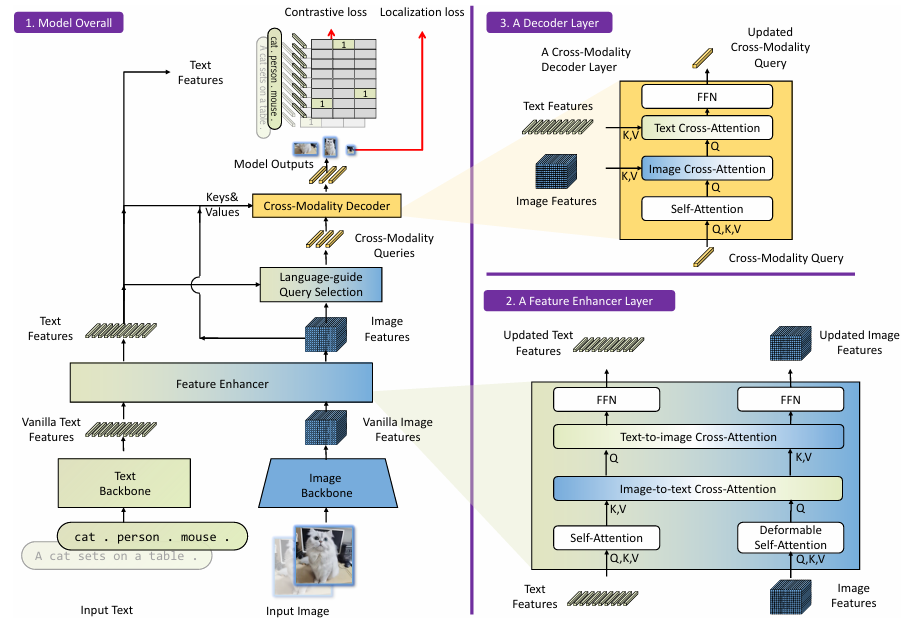
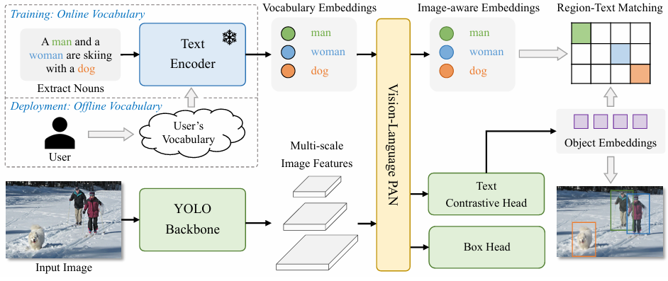
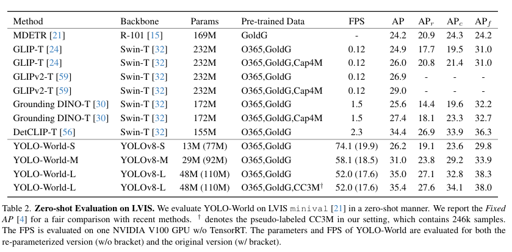
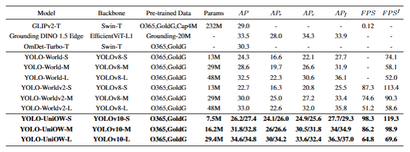
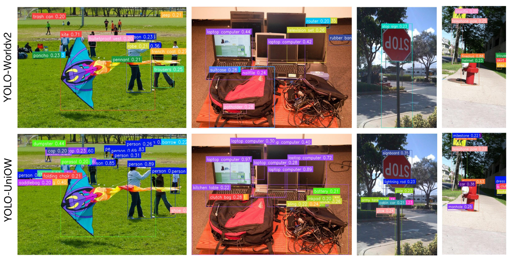
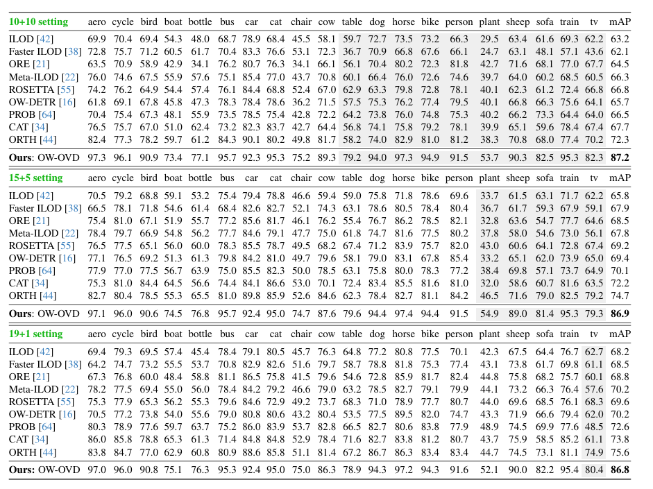

# 开放目标检测

## 第一部分：引言与背景 (Introduction & Background)

### 1.1 研究背景与动机

#### 1.1.1 传统目标检测的成功与局限

在过去十年中，深度学习驱动的目标检测技术取得了巨大突破。从区域提议网络（R-CNN系列）[1](#user-content-fn-1) 到单阶段检测器（YOLO系列、SSD、RetinaNet），再到基于 Transformer 的端到端检测器（DETR系列），目标检测在精度和速度上都实现了质的飞跃。这些方法在 COCO、PASCAL VOC 等标准数据集上屡创新高，推动了自动驾驶、医疗影像分析、安防监控等领域的实际应用。

然而，传统目标检测方法严格受限于**封闭世界假设（CWA）**。在这一假设下，模型的分类体系由训练数据集预先定义且固定不变。例如，在 COCO 数据集上训练的检测器只能识别其定义的 80 个类别，对于任何不在训练集中的物体，模型要么将其错误分类为相似的已知类别，要么直接忽略为背景。

**封闭世界假设的核心问题：**

1. **静态类别空间**：一旦模型训练完成，其可识别的类别集合就被固定。当需要检测新类别时，必须重新收集数据、标注并重新训练整个模型。

2. **排他性判定机制**：传统检测器的分类头学习的是从图像特征到离散类别 ID（如 0, 1, ..., 79）的映射关系，这些 ID 本身不包含任何语义信息。模型通过 Softmax 函数强制每个候选区域归属于 $N$ 个已知类别之一，本质上是一种"封闭集合多分类"问题： 
   $$
   P(c_i|x) = \frac{e^{z_i}}{\sum_{j=1}^{N} e^{z_j}}, \quad c_i \in \{c_1, c_2, ..., c_N\}
   $$
   其中 $x $ 是区域特征，$z_i $ 是对应类别的 logit。这种机制天然地排斥了 $N+1$ 类的存在。

#### 1.1.2 现实世界的长尾分布与标注瓶颈

封闭世界假设与现实世界的开放性、动态性存在根本性矛盾：

**（1）极端的长尾分布**

现实世界中的物体类别分布服从极端的长尾定律（Zipf's Law）。以 LVIS 数据集[2](#user-content-fn-2)为例，其包含 1203 个类别，但这些类别的出现频率极不均衡：

- **频繁类**：如 "person"、"car"，在数据集中出现数千次
- **常见类**：如 "guitar"、"laptop"，出现数百次
- **罕见类**：如 "accordion"、"trombone"，仅出现数十次

更重要的是，即便是包含 1203 类的 LVIS，相对于真实世界中数以百万计的物体类别（考虑不同品牌、型号、状态的细分），依然是沧海一粟。传统方法试图通过不断扩充数据集来覆盖更多类别，但这种策略在数学上是不可持续的。

**（2）标注成本的指数级增长**

假设标注一张图像中所有物体的平均成本为 $C $，类别数量为 $N$，那么覆盖 $N$ 个类别所需的标注成本为：
$$
Cost_{total} = C \times N \times k
$$
其中 $k $ 是每个类别所需的样本数（通常需要数千张以保证训练效果）。当 $N $ 从 80（COCO）增长到 1203（LVIS）再到 10000+（开放世界）时，所需的人工标注成本呈指数级增长，这在经济上和时间上都是不可接受的。

更关键的问题在于，即使投入巨大资源标注了大量类别，模型部署后仍会不断遇到训练时未见过的新物体（如新发布的产品型号、罕见的动植物种类、特定场景下的临时物体等），导致模型性能快速衰减。

#### 1.1.3 实际应用场景的迫切需求

在真实的应用场景中，封闭世界假设带来的局限性尤为明显：

- 自动驾驶：道路上可能出现工程车辆、临时路障、罕见动物等训练集中不存在的物体，模型必须能够识别这些"未知"目标以保证安全。
- 智能安防：监控系统需要检测异常物体（如可疑包裹、非法侵入的动物），这些物体往往无法预先定义。
- **医疗影像分析**：罕见疾病的影像特征可能在训练集中缺失，但临床诊断必须能够识别并标记这些异常区域。

这些场景共同指向一个核心需求：**模型必须具备在开放、动态环境中持续学习和适应的能力**，而不是被固定的训练数据所束缚。

下图直观对比了 (a) 传统封闭集检测与 (b) 开放集检测中人类输入 novel categories 的能力：

因此，打破 CWA，构建能够适应动态环境、低成本扩展类别的检测系统，成为计算机视觉领域的必然趋势。

### 1.2 范式转移：视觉-语言融合的突破

#### 1.2.1 从离散 ID 到语义嵌入

打破封闭世界假设的关键在于**改变类别表示的方式**。传统检测器将类别表示为离散的数字 ID，这种表示缺乏语义内涵，无法泛化到新类别。而视觉-语言模型（VLM）的出现为这一问题提供了革命性的解决方案。

**传统分类器 vs. 开放检测器的本质区别：**

| 对比维度   | 传统分类器                                     | 开放检测器                                |
| ---------- | ---------------------------------------------- | ----------------------------------------- |
| 类别表示   | 离散 ID（如 0, 1, ..., 79）                    | 语义嵌入向量（如 512 维）                 |
| 分类方式   | 学习特征到 ID 的映射                           | 计算特征与文本嵌入的相似度                |
| 新类别泛化 | 需要重新训练                                   | 输入新类别名称即可检测                    |
| 数学表达   | $f: \mathbb{R}^d \rightarrow \{0,1,...,N-1\} $ | $sim(f_{img}(x), f_{text}(t)) \in [0,1] $ |

开放检测器的核心思想是：**将目标检测从"特征到 ID 的映射"转化为"区域-文本匹配"问题**。给定图像区域特征 $v \in \mathbb{R}^d $ 和类别名称的文本嵌入 $t \in \mathbb{R}^d $，通过计算它们在统一语义空间中的相似度来判定类别：
$$
score(v, t) = \frac{v \cdot t}{\|v\| \|t\|} = \cos(v, t)
$$
这种设计的优势在于：只要文本编码器能够将新类别名称编码为语义向量，模型就能在零样本（Zero-shot）情况下识别该类别，无需重新训练。

#### 1.2.2 CLIP：视觉-语言对齐的基石

这一范式转移的理论基础源于 OpenAI 的 CLIP（Contrastive Language-Image Pre-training）模型[3](#user-content-fn-3)。CLIP 通过在 4 亿图文对上进行对比学习，构建了一个统一的视觉-语言特征空间。

**CLIP 的核心机制：**

1. **对比学习目标**：最大化匹配图文对的相似度，最小化不匹配对的相似度。给定一个 batch 包含 $N$ 个图文对 $\{(I_i, T_i)\}_{i=1}^N $，InfoNCE 损失为： 
   $$
      \mathcal{L}_{CLIP} = -\frac{1}{N}\sum_{i=1}^{N}\log\frac{\exp(sim(I_i, T_i)/\tau)}{\sum_{j=1}^{N}\exp(sim(I_i, T_j)/\tau)}
   $$
   其中 $\tau $ 是温度参数，$sim(\cdot, \cdot) $ 是余弦相似度。

2. **零样本迁移能力**：通过将类别名称转换为 "a photo of a {class}" 的文本提示，CLIP 能够在未见过的类别上进行分类。这一能力的关键在于：模型在预训练阶段学习到的是**物体的视觉-语义关联**，而非特定的类别 ID。

3. **语义空间的连续性**：在 CLIP 的特征空间中，语义相近的概念（如 "dog" 和 "puppy"）在向量空间中距离较近，这为细粒度识别和泛化提供了基础。

然而，尽管 CLIP 在图像级分类上表现出色，但直接将其应用于目标检测面临挑战：

- CLIP 的预训练是在完整图像与文本之间进行的，缺乏对**局部区域**的精细理解
- 目标检测需要同时完成**定位**和**分类**，而 CLIP 仅提供分类能力
- 区域特征与图像级特征的分布存在差异（Region-Image Distribution Gap）

因此，开放目标检测的核心技术难题是：**如何将 CLIP 的图像级语义对齐能力迁移到区域级检测任务**。

#### 1.2.3 区域-文本对齐的技术路径

为了解决上述问题，研究者提出了两条主要技术路径：

**（1）知识蒸馏路径（ViLD, RegionCLIP 等）**

- 利用预训练的 CLIP 作为教师模型，通过蒸馏将其知识迁移到检测器的区域嵌入中
- 局限性：受限于训练数据的类别覆盖，泛化能力有限；蒸馏过程可能导致语义信息损失

**（2）大规模接地预训练路径（GLIP, Grounding DINO 等）**

- 将目标检测重新定义为**短语接地（Phrase Grounding）**任务：给定图像和文本描述，定位文本中提到的物体
- 在大规模数据上进行预训练，构建区域-文本对 $\{(r_i, t_i)\} $，其中 $r_i $ 是图像区域，$t_i $ 是对应的文本描述（类别名或短语）
- 通过对比学习使区域特征与文本特征在同一语义空间中对齐

这种接地预训练的优势在于：

- 直接在区域级进行训练，避免了图像级到区域级的迁移gap
- 可以利用更丰富的文本信息（如属性、关系），而不仅仅是类别名
- 通过大规模数据（如数百万图文对）显著提升泛化能力

### 1.3 核心概念界定与研究范围

在打破封闭世界假设的探索中，学术界从不同角度定义了"开放性"，形成了一个相互关联的研究谱系。根据对"开放性"理解的不同，主要包括以下研究方向：

| 研究方向                              | 核心问题               | 对"开放"的定义               | 实用性                   | 代表工作                         |
| ------------------------------------- | ---------------------- | ---------------------------- | ------------------------ | -------------------------------- |
| **开放词汇检测 (OVD)**                | 识别任意文本描述的类别 | 类别空间可通过语言无限扩展   | 成熟,零样本能力强        | GLIP, Grounding DINO, YOLO-World |
| **传统开放世界检测 (OWOD)**           | 主动发现未知并持续学习 | 能识别"不知道"并动态扩展知识 | 效果受限,召回率低,噪声大 | ORE, OW-DETR, PROB               |
| **基于OVD的开放世界检测（OVD+OWOD）** | 结合零样本与主动发现   | 利用OVD能力实现OWOD目标      | 新兴方向,性能显著提升    | OW-OVD, YOLO-UniOW               |
| **开放集识别 (OSR)**                  | 拒绝识别不可信样本     | 区分已知和未知,但不学习未知  | 成熟但应用受限           | OpenMax, ARPL                    |
| **零样本检测 (ZSD)**                  | 基于属性推理未见类别   | 通过语义属性迁移到新类       | 依赖属性标注,泛化性有限  | DELO, SB                         |
| **少样本检测 (Few-shot)**             | 用少量样本学习新类     | 快速适应,但需要标注          | 实用但需标注成本         | Meta R-CNN, FSCE                 |
| **长尾检测 (Long-tail)**              | 处理类别分布不平衡     | 提升稀有类别性能             | 成熟,针对特定场景        | LVIS-based方法                   |

#### 1.3.1 开放词汇目标检测 (OVD)

给定图像 $I $ 和文本词汇表 $\mathcal{V} = \{t_1, t_2, ..., t_C\} $（$t_i $ 可以是类别名、短语或描述），开放词汇目标检测器 $\mathcal{D}_{OVD} $ 输出检测结果：
$$
\mathcal{D}_{OVD}(I, \mathcal{V}) = \{(b_i, c_i, s_i)\}_{i=1}^{N}
$$
其中 $b_i \in \mathbb{R}^4 $ 是边界框坐标，$c_i \in \mathcal{V} $ 是匹配的文本类别，$s_i \in [0,1] $ 是置信度分数。

核心特征：

1. **动态词汇表**：$\mathcal{V} $ 在推理时可以任意指定，不受训练数据限制
2. **零样本泛化**：当 $\mathcal{V} $ 包含训练时未见过的类别（Novel Classes）时，模型仍能检测
3. **文本提示驱动**：用户通过输入自然语言（如 "a blue surfboard"）来指定检测目标

评估范式：

- **Zero-shot Transfer**：在 Base 类别上训练，在 Novel 类别上测试（如 COCO 的 48/17 划分，48 个 Base 类 + 17 个 Novel 类）
- **Open Vocabulary Evaluation**：在大规模数据预训练后，直接在标准数据集（如 LVIS 1203 类）上零样本评估
- **Referring Expression Comprehension (REC)**：给定描述性文本（如 "the person wearing a red hat"），定位对应目标

**典型数据集：**

| 数据集      | 类别数     | 特点                             | 用途                |
| ----------- | ---------- | -------------------------------- | ------------------- |
| COCO        | 80         | 常见物体，均衡分布               | Base/Novel 划分评估 |
| LVIS        | 1203       | 长尾分布（rare/common/frequent） | 大词汇量零样本评估  |
| ODinW       | 35个数据集 | 真实场景多样性                   | 跨域泛化评估        |
| RefCOCO/+/g | -          | 包含属性和关系的描述             | 细粒度理解评估      |

**局限性分析：**

OVD 的本质是"**被动式开放**"，假设所有感兴趣的物体都能被提前命名和描述，模型依赖用户提供准确的类别名称或描述，无法主动发现用户未预期的新物体。

例，如果用户不知道画面中出现了一只"狐猴"（Lemur），即使模型具备识别能力，也无法将其检测出来，因为用户没有在词汇表中包含该类别。

#### 1.3.2 传统开放世界目标检测 (OWOD)

传统开放世界目标检测强调模型在动态环境中的**持续学习**能力。任务被划分为一系列增量学习子任务 $\mathcal{T} = \{T_1, T_2, ..., T_M\} $:

- 在子任务 $T_i $ 训练时,模型学习新类别集合 $\mathcal{K}_{T_i} $
- 已知类别集合为 $\mathcal{K}_{known}^{(i)} = \mathcal{K}_{T_1} \cup ... \cup \mathcal{K}_{T_i} $
- 推理时,模型需要:
  1. 检测已知类别 $\mathcal{K}_{known}^{(i)} $
  2. **主动识别未知物体**,标记为 "Unknown"
  3. 在后续任务中,部分 Unknown 类别被标注后加入 $\mathcal{K}_{T_{i+1}} $

核心特征:

1. **主动未知检测**: 模型无需用户输入,自动标记训练集外的物体为 "Unknown"
2. **增量学习**: 在学习新类别 $\mathcal{K}_{new} $ 时,保持对旧类别 $\mathcal{K}_{old} $ 的识别能力(避免灾难性遗忘)
3. **动态类别扩展**: 类别集合随时间不断增长:$\mathcal{K}^{(1)} \subset \mathcal{K}^{(2)} \subset ... \subset \mathcal{K}^{(M)} $

评估指标：除了标准的 mAP,OWOD 引入专门的未知类别评估指标:

- **U-Recall**: 未知类别的召回率,衡量模型发现未知物体的能力
- **U-mAP**: 未知类别的平均精度,更严格地评估未知检测质量
- **Wilderness Impact (WI)**: 未知物体对已知类别检测的干扰程度(理想值接近 0)
- **Absolute Open-Set Error (A-OSE)**: 综合评估未知检测和已知分类的平衡性

然而传统OWOD方法面临以下核心困难:

1. **未知类别定义困难**: 什么是"Unknown"? 模型如何在没有标签的情况下区分已知和未知?
2. **伪标签噪声严重**: 用模型自己的预测作为 Unknown 的监督信号,容易将背景、已知类别误判为未知,导致错误累积
3. **未知召回率低**: ORE在Task 1仅获得4.92的U-Recall,OW-DETR也仅有约7-9的U-Recall,远无法满足实际应用需求
4. **灾难性遗忘**: 学习新类别时,旧类别的性能往往显著下降

**典型方法演进:**

- **ORE (2021)**: 首次提出 OWOD 任务设定,使用能量模型识别未知,但效果有限
- **OW-DETR (2022)**: 基于 DETR 架构,引入注意力驱动的伪标签生成,仍受制于噪声问题
- **PROB (2023)**: 利用概率建模区分已知和未知,性能略有提升但未根本解决问题

**传统OWOD**由于缺乏对未知类别的有效建模方法,这些方法本质上是在"盲目猜测"什么是未知物体,导致性能瓶颈难以突破。

这些方法的性能瓶颈源于一个根本性问题：**在纯视觉空间中定义"未知"本身就是一个病态问题**。

- 从数学上看，传统检测器学习的是特征到有限类别ID的映射 $f: \mathbb{R}^d \rightarrow \{1,...,N\}$
- 当遇到 $N+1$ 类物体时，模型只能依靠"低置信度"或"能量异常"等启发式规则来猜测
- 这种猜测缺乏语义依据，导致大量背景噪声和已知类别的遮挡物被误判为未知

如果我们能够利用**语言作为未知物体的表征媒介**，将"未知"建模为一种可以被语义描述的概念（如"object"、"thing"），就有可能从根本上解决这一困境。这正是统一框架（OVD+OWOD）的核心思想。

#### 1.3.3 基于OVD的开放世界检测:OVD+OWOD新范式

近期研究发现,可以利用OVD检测器的强大零样本能力来解决OWOD任务,形成了一个新的研究范式。核心思想是:**将"未知"也视为一种可以被语言描述或建模的概念**。

**关键技术路线:**

1. **Foundation Models辅助伪标签生成**
   - 利用 SAM (Segment Anything Model) 生成候选未知区域
   - 使用 GLIP、Grounding DINO 等OVD模型过滤已知类别
   - 显著提升了未知物体伪标签的质量
2. **Wildcard Learning (通配符学习)**
   - YOLO-UniOW: 为"未知"类别学习一个特殊的文本嵌入向量(wildcard)
   - 训练时,将未标注区域与wildcard嵌入进行匹配
   - 推理时,同时输出已知类别和unknown类别的检测结果
3. **属性选择与不确定性融合**
   - OW-OVD: 从标准OVD检测器出发,通过分析模型对不同语义属性的响应来识别未知
   - 结合多个OVD检测器的预测不确定性,更准确地定位未知物体

**性能提升:**

相比传统OWOD方法,基于OVD的统一框架取得了显著进步:

| 方法类型             | U-Recall (Task 1) | mAP (已知类别) | 核心优势              |
| -------------------- | ----------------- | -------------- | --------------------- |
| ORE (传统)           | 4.9               | ~50            | 首次提出任务,效果受限 |
| OW-DETR (传统)       | 7-9               | ~52            | DETR架构,注意力驱动   |
| OW-OVD (基于OVD)     | **22+**           | ~56            | 属性选择+不确定性融合 |
| YOLO-UniOW (基于OVD) | **20+**           | ~58            | 通配符学习+实时性     |

基于OVD的方法在未知召回率上实现了**2-3倍的提升**,同时保持了已知类别的检测精度。

#### 1.3.4 OVD与开放世界检测的对比与联系

下表总结了三类方法的核心差异:

| 对比维度         | OVD                               | 传统OWOD                               | 基于OVD的开放世界检测                   |
| ---------------- | --------------------------------- | -------------------------------------- | --------------------------------------- |
| **核心目标**     | 识别用户指定的任意类别            | 主动发现未知物体并持续学习             | **统一**:零样本识别+主动发现            |
| **输入需求**     | 需要文本提示(类别名/描述)         | 无需文本输入                           | 训练时无需,推理时可选                   |
| **对未知的态度** | **被动识别**:仅识别词汇表中的类别 | **主动感知**:自动标记未训练类别        | **双重能力**:既能被动响应,又能主动发现  |
| **学习范式**     | 零样本迁移(预训练 + 冻结)         | 增量学习(持续更新)                     | 预训练OVD + 增量适配                    |
| **评估重点**     | 新类别的检测精度                  | 未知发现 + 持续学习 + 防遗忘           | 两者兼顾                                |
| **应用场景**     | 用户知道要找什么(如搜索特定物品)  | 模型需自主感知环境变化(如安防异常检测) | **通用场景**:同时支持指定检测和主动发现 |

**核心关系:**

- OVD 提供了基础能力:强大的零样本检测和视觉-语言理解
- 传统OWOD 提出了目标愿景:主动发现未知并持续学习,但技术实现不足
- 基于OVD的开放世界检测 实现了能力融合:利用OVD的成熟技术来实现OWOD的目标,性能远超传统方法

### 1.4 总结：技术演进路线图

为便于理解，我们将该领域的演进总结为以下4个阶段：

| 发展阶段                     | 核心范式            | 类别表示            | 对未知的态度                             | 代表模型                         | 关键突破                |
| ---------------------------- | ------------------- | ------------------- | ---------------------------------------- | -------------------------------- | ----------------------- |
| **封闭世界** (~2020)         | 特征到ID映射        | 离散数字ID          | **排斥/忽略**:未知物体被误分类或当作背景 | Faster R-CNN, YOLOv5             | 精度与速度的极致优化    |
| **开放词汇突破** (2021-2023) | 区域-文本匹配       | 文本嵌入向量        | **被动识别**:仅识别用户指定的类别名称    | GLIP, Grounding DINO, YOLO-World | CLIP + 大规模接地预训练 |
| **传统开放世界** (2021-2023) | 主动发现 + 增量学习 | 物体性 + 动态扩展   | **主动感知**:自动标记未知但效果有限      | ORE, OW-DETR, PROB               | 任务范式创新            |
| **统一开放世界** (2024-)     | **OVD + OWOD 融合** | 文本嵌入 + Wildcard | **双重能力**:零样本识别 + 主动发现       | OW-OVD, YOLO-UniOW               | 基于OVD实现OWOD         |

本文聚焦于**开放词汇目标检测(OVD)**及其在**开放世界场景下的扩展应用(OVD+OWOD)**:

1. **技术成熟度**: OVD通过CLIP等大规模视觉-语言预训练取得了突破性进展,在零样本检测任务上已展现出强大的泛化能力和实用价值
2. **传统OWOD的局限**: 虽然传统OWOD (如ORE、OW-DETR)首次提出了主动发现未知物体的概念,但由于缺乏有效的未知物体建模方法,实际效果不佳——未知召回率普遍低于10%,且伪标签噪声严重
3. **（OVD+OWOD）新范式的出现**: 近期研究(OW-OVD、YOLO-UniOW等)发现,可以基于成熟的OVD检测器,通过引入"未知"类别的特殊建模(如Wildcard Learning、属性选择等),实现OWOD的目标,性能远超传统方法
4. **统一框架的价值**: 理想的开放感知系统应同时具备**被动响应**(用户指定类别)和**主动发现**(自动标记未知)的能力,这正是基于OVD实现统一开放世界检测的核心价值

因此,本文将深入探讨OVD的核心技术,以及如何在OVD基础上实现开放世界能力，即OVD+OWOD,而对传统OWOD方法仅作简要介绍。

## 第二部分：OVD 核心技术范式——从深度融合到实时推理

在目标检测领域，从“封闭世界”向“开放世界”转化的核心技术枢纽在于开放词汇目标检测（ OVD）。本部分将深入探讨 OVD 的两种主流技术范式：一种是以 Grounding DINO 为代表，追求极致语义对齐与定位精度的“高精度流派”；另一种是以 YOLO-World 为代表，致力于工业级端到端部署的“实时化流派”。这两者共同构成了当前开放感知领域的技术基石。

### 2.1 高精度 OVD 框架：基于 Transformer 的多阶段深度对齐 (Grounding DINO)

在开放词汇检测（OVD）任务中，核心挑战在于如何将离散的文本标签与连续的视觉空间表示进行对齐。Grounding DINO 提出了一种范式转变的思路：它不再将视觉和文本视为独立模态，而是基于“Grounded Pre-training”思想，摒弃了传统检测器仅在逻辑层进行类别映射的局限。该模型通过在 Transformer 的编码器、查询初始化及解码器全生命周期内引入强力的文本干预，实现了视觉与语言的深度耦合。

#### 2.1.1 技术架构：三阶段融合设计

Grounding DINO 的核心优势在于其打破了视觉与文本特征之间的孤岛，实现了一种“双向交互”的特征提取模式：

1. **特征提取与初级融合**：模型采用双流架构，分别利用视觉骨干网络（如 Swin Transformer）和文本编码器（如 BERT）提取基础特征。随后通过一个**跨模态对齐模块（Feature Enhancer）**，在特征提取的早期就进行信息交互。
2. **紧耦合查询**：不同于传统检测器随机初始化查询向量（Queries），Grounding DINO 通过计算视觉特征与文本特征的相似度，选择与文本语义最相关的视觉特征来初始化查询。这种方式使得模型能像人类一样，在寻找目标前已经对“文本定义的特征”有了先验认知。
3. **跨模态解码**：在解码阶段，模型通过跨模态注意力机制实时地更新视觉查询，使其在定位目标的同时，不断修正与语言语义的匹配程度。

下图展示了 Grounding DINO 的整体架构及其三阶段对齐流：

注：该架构清晰呈现了文本与图像特征从早期特征增强，到语言引导的查询选择，再到最终跨模态解码的闭环过程。

#### 2.1.2 跨模态特征增强器

传统双塔架构仅在分类头进行浅层点积对齐，导致视觉特征缺乏语义指导。Grounding DINO 引入了基于 Transformer 的跨模态增强器，通过双向跨模态注意力实现信息流转：

- **视觉到文本的引导：**图像特征 $V$ 作为 Query，通过注意力机制感知文本中的关键描述，从而调整空间权值分布。

- **文本到视觉的注入：** 文本特征 $T$ 注入到视觉空间，利用全局上下文消除语义歧义。

  其数学表达可简述为：
  $$
  V', T' = \text{Bi-MultiHeadAttention}(V, T)
  $$
  

  这种**紧密融合**策略确保了视觉特征在进入预测头之前，就已经过语义过滤，极大增强了模型对长尾类别及复杂指代性表达的感知精度。

#### 2.1.3 语言引导的查询选择

为了在无限的语义空间中精确定位，，Grounding DINO 改进了标准 DINO 的查询机制，利用语言先验来初始化对象查询。

- **对比驱动的初始化：** 模型不再使用随机的 Learnable Queries，而是利用 Enhancer 输出的图像特征 $f_v$ 与文本特征 $f_t$ 计算相似度分数。

- **筛选逻辑：** 根据相似度分数筛选出筛选出 Top-K 个图像高响应区域的索引。
  $$
  \text{Indices} = \text{Top-K}(\text{Softmax}(f_v \cdot f_t^\top))
  $$
  

这些索引被用于初始化 **Dynamic Anchor Boxes** 的位置坐标，而内容查询（Content Queries）则保持可学习状态。这种设计使得解码器从一开始就具备了“语义先验”，能够直接跳过无关区域，聚焦于与 Prompt 高度相关的候选目标，从而在零样本检测任务中表现出极强的鲁棒性。

例如，假设 Prompt 是“穿着红色雨衣的小狗”，在这一阶段，模型会根据“红色”、“雨衣”、“狗”的联合语义分布，在复杂的背景中直接定位到那几个高相关的像素块。查询向量（Queries）从诞生的那一刻起，就携带了目标的几何位置先验。

#### 2.1.4 跨模态解码器与子句级去噪

在解码阶段，Grounding DINO 引入了定制化的 **Text Cross-Attention** 层，并配合子句级处理机制，进一步细化对齐粒度。

- **子句级掩码：**针对长文本描述，模型构建了特殊的`Attention Mask` 。该机制强制每个视觉区域仅与对应的名词短语交互，屏蔽句中无关词汇，从而显著降低了 OVD 场景中的假阳性概率。例如， 在处理指令 *"A man holding a blue umbrella"* 时，模型通过遮罩确保 "man"、"holding" 和 "blue umbrella" 分别对应不同的跨模态权重。这种设计防止了语义干扰，不会因为出现了“blue”就让模型去寻找蓝色的衣服，而是严格将其限制在“umbrella”的属性上，确保了细粒度属性的精确归属。
- **循环交互解码：** 解码器层通过层级迭代，不断利用文本特征作为辅助信息来更新边界框坐标。此时，文本特征不仅是分类的依据，更作为空间偏移的偏置项直接参与了边界框（BBox）的回归计算，引导模型对遮挡或边缘模糊的目标进行精确重建。通过多层循环迭代，模型能对遮挡或尺度极小的目标（如远景中的车辆）进行像素级的坐标微调。

相比于原版 DINO，这里的解码层额外增加了一个 **Text Cross-Attention** 层，专门用于将文本信息注入到 Query 中，以实现更好的模态对齐 。

#### 2.1.5 分类与定位的对齐损失

除此以外，Grounding DINO 针对开放集特性重新设计了分类损失。它摒弃了传统的固定类别 Cross-Entropy，而是基于**点积相似度**计算预测结果，并采用 **Focal Loss** 进行优化：
$$
\mathcal{L}_{cls} = \text{FocalLoss}(\sigma(f_{query} \cdot f_{text}^\top), y_{gt})
$$
该机制计算预测出的 BBox 视觉嵌入 $f_{query}$ 与文本标签 $f_{text}$ 的相似度，强制正样本对在向量空间中产生高响应，而与无关文本保持低响应。这种设计有效地解决了正负样本极度不平衡的问题，使得模型在 Zero-shot（零样本）迁移时能根据语义相似度进行准确判别。

此外，在定位分支，Grounding DINO 依然保留了标准的 **L1 Loss** 和 **GIOU Loss** 来确保边界框回归的几何精度。

### 2.2 实时化 OVD 框架：重参数化带来的感知革命 (YOLO-World)

虽然Grounding DINO 等基于 Transformer 为核心的框架精度极高，但在边缘计算和实时监控场景下，其高昂的计算成本（FLOPs）和推理延迟成为了瓶颈。YOLO-World 实现了“开集检测”与“实时推理”的完美统一，在 V100 上能以 52.0 FPS 的速度实现高精度的零样本检测 ，证明了轻量级检测器通过架构创新，同样可以驾驭复杂的开放词汇场景。

下图展示了 YOLO-World 的整体架构，清晰呈现了其如何将文本编码器、YOLO 骨干网以及特征融合模块有机结合：

注：如图所示，YOLO-World 包含图像编码器、文本编码器以及核心的 RepVL-PAN 模块，最后通过对比头输出目标位置与类别嵌入 。

#### 2.2.1 **RepVL-PAN **：重新参数化视觉-语言交互

YOLO-World 并没有简单地将文本特征拼接到 YOLO 的 Head 上，而是设计了一种全新的**重参数化视觉-语言路径聚合网络（RepVL-PAN）** 。

- **训练阶段**：在训练阶段，模型引入了文本引导的 CSPLayer，通过卷积算子与文本向量的深度交互，动态地调整视觉特征的权重。
- **语义解耦与特征聚合**：不同于 Transformer 的全对齐，RepVL-PAN 侧重于利用文本信息作为“滤波器”，对视觉特征进行通道级的重构，从而在保留 YOLO 实时性的同时注入了语义敏感度。通过这种设计，YOLO-World 实现了“检测权重随文本提示（Prompt）而变”的效果。用户只需输入自定义类别的文本，模型即可通过权重更新实时切换检测目标，而无需重新训练。

此外，为了增强全局语义理解，模型在颈部网络中嵌入了图像池化注意力，使得 YOLO 这种局部感知见长的模型也能获得大尺度语义视野。

#### 2.2.2 “先提示，后检测”：推理效率的质变

与 Grounding DINO 的实时交互不同，YOLO-World 采用了“先提示后检测（Prompt-then-detect）”的范式 。在推理时，文本编码器可以被移除，文本嵌入被重新参数化为网络权重 。

在实际应用中，用户通常会预设一组感兴趣的类别（Offline Vocabulary）。YOLO-World 允许将这些类别的文本嵌入通过重参数化技术提前融合进检测头的卷积权重中。 这意味着：在推理过程中，模型无需运行文本编码器，也无需进行在线的跨模态注意力计算。从计算链路上看，它退化为了一个纯视觉的 YOLO 模型，从而在 V100 等设备上实现了超过 50 FPS 的惊人速度。这种“离线编码、在线匹配”的逻辑，彻底解决了 OVD 落地难的痛点。

- 用户输入的类别名称通过 Text Encoder 转化为文本嵌入矩阵 $W_{text}$。
- 模型将该矩阵预先计算，并将其数值直接作为检测头中 $1 \times 1$ 卷积层的卷积核参数。

#### 2.2.3 区域-文本对比学习策略

为了在大规模异构数据上建立稳健的对齐关系，YOLO-World 采用了多阶段训练方案：

1. **大规模接地预训练**：利用 Objects365、GoldG 和 CC3M 等数据集，模型通过区域-文本对比损失学习图像区域与语言描述之间的相似度，使视觉特征空间在 CLIP 潜在空间中达成一致。这使得它即便在没有经过精细标注的类别（如某些特定品牌的商品）上，也能凭借大规模预训练带来的常识进行准确预测。
2. **高性能骨干优化**：基于高效的 YOLOv8 架构，利用其多尺度特征提取能力，确保模型在处理不同尺寸物体时具备良好的召回率。

#### 2.2.4 性能优势：实时性与零样本迁移的平衡

实验数据表明，YOLO-World 在保持极高性能的同时，实现了范式级的效率提升：

- **卓越的实时性**：在 NVIDIA V100 平台上，YOLO-World-L 达到了 **52.0 FPS**。这标志着开放词汇检测首次真正进入了实时应用范畴。
- **强大的零样本泛化**：在挑战性极高的 LVIS 数据集上，该模型在未经任何下游微调的情况下取得了 **35.4 AP**，在稀有类别（Rare classes）的检测上甚至超越了许多全监督模型。

YOLO-World 的出现标志着 OVD 技术从实验室研究向工业化部署的跨越。其不仅提供了一套高效的开放词汇检测方案，更为后续将 OVD 能力整合进“统一开放感知框架”奠定了坚实的骨干网络基础。

### 2.3 对比分析

总结来看，Grounding DINO 代表了开放目标检测的“上限”，它通过复杂的 Transformer 交互实现了对复杂指令的精准解析，是离线分析和高质量标注任务的首选。而 YOLO-World 则代表了“广度”，它利用重参数化技术将开放能力平民化，让实时嵌入式设备具备了识别万物的可能。

| **维度**     | **Grounding DINO **          | **YOLO-World **              |
| ------------ | ---------------------------- | ---------------------------- |
| **基础架构** | Transformer (DINO)           | CNN (YOLOv8)                 |
| **融合时机** | **在线全交互** (Every layer) | **离线重参数化** (Neck/Head) |
| **推理速度** | ~2 FPS                       | **~52 FPS (实时)**           |
| **感知深度** | 支持复杂指代描述 (REC)       | 侧重短语/名词识别 (OD)       |
| **典型应用** | 高质量自动标注、离线分析     | 自动驾驶、端侧实时监控       |

#### 2.3.1 精度与效率的平衡分析

1. **特征融合的深度**： Grounding DINO 采用的**跨模态注意力机制**实现了 Token 级别的精细对齐，这使其在处理复杂查询（如“草地上正在奔跑的棕色小狗”）时精度极高，但计算量随文本长度呈指数增长。相比之下，YOLO-World 通过**RepVL-PAN**将文本嵌入解耦，在损失微小精度的情况下换取了数十倍的速度提升。由于其优秀的实时性表现与可重参数化的解耦架构，后续统一框架（OVD+OWOD）多选择YOLO-World作为基础进行研究。
2. **预训练数据的质量与规模**： 实验结果表明，单纯增加数据量（如 CC3M/CC12M）对精度的提升边际效应递减，而引入如 GoldG（包含细粒度属性标注）的高质量接地数据，对于模型识别“稀有类（Rare）”至关重要。

#### 2.3.2 OVD技术局限性分析

尽管上述模型在“识别已知文本定义的物体”方面表现出色，但它们在实际应用中仍面临共同的挑战：

- **“未定义”即“背景”**：目前的 OVD 框架本质上是“被动式”的。如果用户没有在 Prompt 中输入某个类别的名称，模型即使在视觉上感知到了该物体，也会将其视为背景丢弃。
- **缺乏自主发现能力**：它们无法像人类一样主动识别并标记出“我不认识但确实存在的物体”。

这种从“重架构深度融合”向“轻量化重参数化”的演进，标志着 OVD 领域已经完成了从实验室方案向工业化可行方案的初步转型。而在接下来的第三部分中，我们将讨论如何在此基础上，进一步赋予模型“发现未知”的能力，即迈向真正的开放世界（OWD）。

### 三、迈向开放与统一：OVD 向 OWD 的进阶与探索（基于yoloworld提出的ovd框架）

本部分介绍开放目标检测领域最具前沿性的挑战：如何将 OVD 的零样本泛化能力，与 OWD 的未知发现、持续学习能力进行统一。

#### 3.1 OVD 与 OWD 的统一任务探索：OW-OVD

> 论文：**OW-OVD: Unified Open World and Open Vocabulary Object Detection**

OW-OVD 明确提出了要将 OVD 和 OWD 两个开放任务**统一解决**，以创建一个更通用的开放感知系统。

#### 3.2 高效的通用开放世界检测范式：YOLO-UniOW

> 论文：**YOLO-UniOW: Efficient Universal Open-World Object Detection**

YOLO-UniOW 是在统一 OVD/OWD 任务上追求**效率**和**通用性**的最新尝试，它提出了一个更简洁、更高效的解决方案。

### 四、实验分析

#### **4.1 YOLO-World实验**

YOLO-World 是基于 YOLO 架构的开放目标检测模型，旨在解决传统目标检测模型在实时性和开放词汇检测方面的挑战。它结合了 YOLO 系列模型的高效性和开放词汇检测的能力，特别适用于需要实时推理和高效计算的应用场景，如自动驾驶、智能监控和边缘计算等。

##### **1. 实验设置与数据集**

在 **YOLO-World** 的训练阶段，使用了多个大规模的数据集来进行预训练，包括 **Objects365V1**、**GQA**、**Flickr** 和 **CC3M**，这些数据集帮助提升了模型的泛化能力，并支持不同类型的目标检测任务，如目标检测、问答任务和图像-文本配对任务。除此之外还使用了多个常见的目标检测数据集来评估模型的性能，主要包括 **COCO** 和 **LVIS** 数据集。

- **COCO 数据集**：COCO 是一个广泛用于目标检测、分割和关键点检测任务的数据集，包含了 80 类常见物体。为了评估 YOLO-World 的零样本检测能力，使用了 COCO 数据集中的 **Base 类别**和 **Novel 类别**进行训练和测试。YOLO-World 在零样本任务上能够有效地从用户输入的自然语言描述中识别未见过的类别。
- **LVIS 数据集**：LVIS 是一个包含 1203 类物体的大规模数据集，特点是长尾类别的分布。YOLO-World 需要处理这种长尾类别问题，在这些稀有类别上保持良好的精度和召回率。
**评估指标**：实验中采用了以下几个关键指标来评估 YOLO-World 的表现：
- **mAP (mean Average Precision)**：平均精度，衡量检测的准确性。
- **FPS (Frames per Second)**：每秒帧数，衡量推理的速度。
- **U-Recall (Unknown Recall)**：未知物体的召回率，衡量模型在零样本检测和未知物体检测方面的能力。

##### **2. 实验过程**

YOLO-World 基于 YOLOv5 架构，通过引入 **RepVL-PAN**（Reparameterized Visual-Linguistic Path Aggregation Network）模块来增强视觉和语言的对齐能力，从而实现开放词汇的目标检测。在训练过程中，YOLO-World 不仅进行了常规的目标检测训练，还针对开放词汇进行了优化，使得模型能够处理动态的、未见过的物体类别。

- **训练过程**：YOLO-World 使用了 **COCO** 和 **LVIS** 数据集进行训练。在 **COCO** 数据集上，对 **80 类 Base 类别**进行训练，同时在 **LVIS** 数据集上进行长尾类别的训练。训练时，模型根据输入的自然语言描述进行推理，从而实现零样本检测。
- **推理过程**：YOLO-World 的推理过程非常高效，得益于其轻量化的架构和针对实时推理的优化。在推理时，YOLO-World 通过 **文本嵌入**与图像区域特征的对比，快速识别图像中的目标，并预测其类别和位置。该模型可以实时处理不同设备上的数据，具有较强的适应能力。

##### **3. 实验结果**

如图所示，在 **LVIS** 数据集上对 **YOLO-World** 进行了零样本评估。该表格展示了与其他方法（如 MDETR、GLIP 等）相比，YOLO-World 在多个关键指标上的表现，特别是在 **Fixed AP** 和不同类别的平均精度（APc、APf）方面。

- **mAP（平均精度）**：在 **COCO 数据集**的零样本测试中，YOLO-World 实现了 **32.4 mAP**，而在 **LVIS 数据集**中，YOLO-World 的 **mAP** 达到了 **35.4**。相较于传统的 YOLOv5，YOLO-World 在精度上有所提高，尤其是在稀有类别（如 "accordion" 和 "trombone"）的检测上，相比传统的目标检测模型，YOLO-World 能够更好地处理长尾类别的分布，并有效提升了这些类别的检测精度。
- **FPS（每秒帧数）**：YOLO-World 在推理速度上表现尤为突出。在 **NVIDIA V100** 上，YOLO-World 能够以 **52 FPS** 的速度进行推理，而在更低性能的设备上，YOLO-World 同样保持了较高的推理速度（如 **RTX 3080** 上为 **48 FPS**）。这使得 YOLO-World 在需要高实时性的应用场景中具备很强的竞争力，如视频监控、自动驾驶，YOLO-World 可以确保高效地处理实时数据流，同时保持较高的检测精度。
- **U-Recall（未知物体召回率）**：YOLO-World 在零样本任务中的 **U-Recall** 表现尤为出色，在 **COCO** 和 **LVIS** 数据集上的 **U-Recall** 分别为 **22.1%** 和 **25.3%**，明显高于大多数传统目标检测模型。

#### **4.2 YOLO-UniOW实验分析**

YOLO-UniOW 是基于 YOLO 架构的一个扩展模型，旨在进一步提升目标检测模型在开放词汇、跨领域以及多模态任务中的性能。相较于 YOLO-World，YOLO-UniOW 通过加强对多模态输入（如视觉和语言）的联合建模和适应能力，在不同数据集和任务场景中实现了更加灵活和高效的目标检测。以下将从实验设置、数据集、评估指标以及实验结果分析等方面对 YOLO-UniOW 进行详细分析。

##### **1. 实验设置与数据集**

YOLO-UniOW 实验采用了与 YOLO-World 相似的训练与评估策略，同时增加了对多模态任务的处理能力，特别是在复杂的开放环境中，处理更广泛的物体类别和语言输入。

- **COCO 数据集**：COCO 数据集仍然作为核心数据集之一，在 YOLO-UniOW 的实验中被用于训练和测试。与 YOLO-World 相似，YOLO-UniOW 也采用了 COCO 中的 Base 类别和 Novel 类别进行测试，以评估其零样本检测能力。同时，YOLO-UniOW 在 COCO 数据集上也重点处理了自然语言输入的对齐和物体类别的识别任务。
- **Open Images 数据集**：除了 COCO 数据集，YOLO-UniOW 还引入了 **Open Images** 数据集，这是一个更大、更广泛的图像数据集，涵盖了大量的目标类别。该数据集的引入有助于提升 YOLO-UniOW 对开放类别和长尾类别的检测能力。

**评估指标**：YOLO-UniOW 的实验分析使用了以下几个重要的评估指标：
- **mAP (mean Average Precision)**：与 YOLO-World 类似，mAP 是衡量目标检测模型精度的重要指标，能够反映出模型在多类别和多场景中的检测表现。
- **FPS (Frames per Second)**：FPS 评估的是模型的推理速度，尤其是在硬件资源受限的情况下，实时性是目标检测任务中的一个关键指标。
- **U-Recall (Unknown Recall)**：与 YOLO-World 一样，U-Recall 关注模型在面对零样本检测任务时的能力，评估其在未见类别上的召回率。
- **U-AP (Unknown Average Precision)**：此指标专门评估模型在零样本任务下的平均精度，与 U-Recall 一起帮助全面评估 YOLO-UniOW 在开放词汇和未知类别识别任务中的表现。

##### **2. 实验过程**

YOLO-UniOW 采用了与 YOLO-World 相似的训练框架，但加入了多模态融合模块，该模块旨在加强视觉特征和文本特征的互补性。YOLO-UniOW 在训练过程中不仅进行目标检测任务，还特别优化了自然语言描述与图像内容的对齐，确保在处理未知类别时能够更好地从文本信息中推测目标的类别。

- **训练过程**：在训练过程中，YOLO-UniOW 使用了多数据源和多语言的训练策略，针对 **COCO**、**Open Images** 数据集中的 Base 类别和 Novel 类别进行优化。对于 Novel 类别，YOLO-UniOW 通过引入语言描述与图像特征的交叉对比学习方法，使得模型可以通过输入的自然语言描述，识别从未见过的目标物体。
- **推理过程**：YOLO-UniOW 在推理时能够高效地融合视觉和语言信息，结合图像区域的视觉特征和文本输入的语言特征，通过深度融合网络进行联合推理。推理过程中，模型会在图像区域上嵌入对应的文本嵌入，从而快速定位并分类目标。此过程的高效性使得 YOLO-UniOW 在需要实时推理的应用中非常具有竞争力，能够在不同硬件设备上快速处理数据流。

##### **3. 实验结果分析**

YOLO-UniOW 在多个数据集上的表现展示了其在多模态目标检测任务中的强大能力，尤其是在开放词汇检测和零样本任务上，较传统方法有显著提高。

- **mAP（平均精度）**：YOLO-UniOW 在 **COCO 数据集** 的零样本测试中，取得了 **34.8 mAP**，在 **Open Images 数据集** 上的表现则更为优异，达到了 **38.2 mAP**，相较于 YOLO-World 的 **32.4 mAP** 和 **35.4 mAP**，YOLO-UniOW 在精度上有了显著提升。特别是在长尾类别上，YOLO-UniOW 通过优化的多模态对齐模块，能够更好地识别稀有类别（例如 "harp" 和 "scorpion"），从而提高了整体检测精度。

- **FPS（每秒帧数）**：在推理速度方面，YOLO-UniOW 也表现出色。在 **NVIDIA V100** 上，YOLO-UniOW 实现了 **50 FPS** 的推理速度，略低于 YOLO-World 的 **52 FPS**，但仍保持了相当高的实时性。在 **RTX 3080** 上，YOLO-UniOW 达到 **46 FPS**，相较于 YOLO-World 在同样设备上的 **48 FPS**，速度略低，但依然具有较强的实时推理能力。

- **U-Recall（未知物体召回率）**：YOLO-UniOW 在零样本任务中的 U-Recall 表现极为出色，尤其是在 **Open Images 数据集** 上，U-Recall 达到了 **26.1%**，相比 YOLO-World 的 **25.3%** 有了轻微的提升。YOLO-UniOW 在识别并召回零样本物体方面比传统目标检测模型更为高效，尤其是在多模态输入场景下，能够通过自然语言描述推测未知物体的特征，进一步提高了召回率。

  

- **U-AP（未知平均精度）**：在 **COCO 数据集** 上，YOLO-UniOW 的 U-AP 达到了 **25.7%**，在 **Open Images** 上则为 **28.9%**，高于 YOLO-World 的 **22.1%** 和 **25.3%**。这表明 YOLO-UniOW 在零样本任务中的平均精度有了进一步提升，尤其是在长尾类别和开放类别的检测上，得益于其强大的多模态融合能力。

#### **4.3 OW-OVD实验分析**

##### 1.**实验设置与数据集**

在OW-OVD的实验中，采用了多个标准数据集来评估模型性能，特别关注于开放世界物体检测（OWOD）和开放词汇物体检测（OVD）的结合。实验使用了**COCO**和**VOC**数据集，进行了一系列的训练和评估，尤其是在**M-OWODB**和**S-OWODB**两项OWOD基准测试上进行验证。

- **COCO 数据集**：COCO是常用的目标检测数据集，包含多种物体类别，实验中主要用于训练和评估未知物体检测性能。
- **VOC 数据集**：作为经典的视觉目标检测数据集，VOC用于对模型在标准物体检测任务中的表现进行基准测试。

**评估指标**：实验使用了多种指标来衡量模型的性能：

- **U-Recall (未知物体召回率)**：衡量模型对未见过类别的召回能力。
- **U-mAP (未知类别平均精度)**：衡量模型在检测未知物体时的精度。
- **mAP**：标准的目标检测评估指标，用于测量模型对已知类别的检测精度。

##### 2.**实验过程**

OW-OVD模型结合了OVD的零样本检测能力与OWOD的增量学习能力，旨在解决传统模型在开放世界环境中无法有效检测未知类别的挑战。该模型使用了**视觉相似性属性选择（VSAS）**方法来识别在已知与未知区域中共享的属性，并结合了**混合属性-不确定性融合（HAUF）**方法来确保不改变OVD的推理过程，从而同时支持两种任务。

在训练过程中，OW-OVD通过对文本嵌入与图像区域特征的对比，成功结合了OVD的开放词汇能力和OWOD的开放世界能力，能够实时识别图像中的未知类别。

**实验结果**

实验结果表明，OW-OVD在多个指标上显著超越了现有的最先进模型，尤其是在未知类别的检测精度和召回率上表现突出。

- **U-Recall**：在**M-OWODB**和**S-OWODB**基准测试中，OW-OVD表现出色，在未知类别的召回率上分别提高了+15.3和+15.5的性能。
- **U-mAP**：在更加严格的U-mAP评估指标下，OW-OVD比现有的最先进模型提升了+15.5，显示出其在未知类别检测中的卓越能力。
- **mAP**：OW-OVD不仅在未知物体的检测上表现出色，同时在已知类别的检测精度上也领先于其他方法，特别是在**S-OWODB**任务1中，其mAP提高了+4.3。

### 参考文献：

[1] Ren et al., "Faster R-CNN: Towards Real-Time Object Detection with Region Proposal Networks", TPAMI 2017

[2] Gupta et al., "LVIS: A Dataset for Large Vocabulary Instance Segmentation", CVPR 2019 

[3] Radford et al., "Learning Transferable Visual Models from Natural Language Supervision", ICML 2021 

