# 开放目标检测

## 一、引言与背景

### 1.1 研究背景与动机

#### 1.1.1 传统目标检测的成功与局限

在过去十年中，深度学习驱动的目标检测技术取得了巨大突破。从区域提议网络（R-CNN系列）[1](#user-content-fn-1) 到单阶段检测器（YOLO系列、SSD、RetinaNet），再到基于 Transformer 的端到端检测器（DETR系列），目标检测在精度和速度上都实现了质的飞跃。这些方法在 COCO、PASCAL VOC 等标准数据集上屡创新高，推动了自动驾驶、医疗影像分析、安防监控等领域的实际应用。

然而，传统目标检测方法严格受限于**封闭世界假设（CWA）**。在这一假设下，模型的分类体系由训练数据集预先定义且固定不变。例如，在 COCO 数据集上训练的检测器只能识别其定义的 80 个类别，对于任何不在训练集中的物体，模型要么将其错误分类为相似的已知类别，要么直接忽略为背景。

**封闭世界假设的核心问题：**

1. **静态类别空间**：一旦模型训练完成，其可识别的类别集合就被固定。当需要检测新类别时，必须重新收集数据、标注并重新训练整个模型。

2. **排他性判定机制**：传统检测器的分类头学习的是从图像特征到离散类别 ID（如 0, 1, ..., 79）的映射关系，这些 ID 本身不包含任何语义信息。模型通过 Softmax 函数强制每个候选区域归属于 $N$ 个已知类别之一，本质上是一种"封闭集合多分类"问题： 
   $$
   P(c_i|x) = \frac{e^{z_i}}{\sum_{j=1}^{N} e^{z_j}}, \quad c_i \in \{c_1, c_2, ..., c_N\}
   $$
   其中 $x $ 是区域特征，$z_i $ 是对应类别的 logit。这种机制天然地排斥了 $N+1$ 类的存在。

#### 1.1.2 现实世界的长尾分布与标注瓶颈

封闭世界假设与现实世界的开放性、动态性存在根本性矛盾：

**（1）极端的长尾分布**

现实世界中的物体类别分布服从极端的长尾定律（Zipf's Law）。以 LVIS 数据集[2](#user-content-fn-2)为例，其包含 1203 个类别，但这些类别的出现频率极不均衡：

- **频繁类**：如 "person"、"car"，在数据集中出现数千次
- **常见类**：如 "guitar"、"laptop"，出现数百次
- **罕见类**：如 "accordion"、"trombone"，仅出现数十次

更重要的是，即便是包含 1203 类的 LVIS，相对于真实世界中数以百万计的物体类别（考虑不同品牌、型号、状态的细分），依然是沧海一粟。传统方法试图通过不断扩充数据集来覆盖更多类别，但这种策略在数学上是不可持续的。

**（2）标注成本的指数级增长**

假设标注一张图像中所有物体的平均成本为 $C $，类别数量为 $N$，那么覆盖 $N$ 个类别所需的标注成本为：
$$
Cost_{total} = C \times N \times k
$$
其中 $k $ 是每个类别所需的样本数（通常需要数千张以保证训练效果）。当 $N $ 从 80（COCO）增长到 1203（LVIS）再到 10000+（开放世界）时，所需的人工标注成本呈指数级增长，这在经济上和时间上都是不可接受的。

更关键的问题在于，即使投入巨大资源标注了大量类别，模型部署后仍会不断遇到训练时未见过的新物体（如新发布的产品型号、罕见的动植物种类、特定场景下的临时物体等），导致模型性能快速衰减。

#### 1.1.3 实际应用场景的迫切需求

在真实的应用场景中，封闭世界假设带来的局限性尤为明显：

- 自动驾驶：道路上可能出现工程车辆、临时路障、罕见动物等训练集中不存在的物体，模型必须能够识别这些"未知"目标以保证安全。
- 智能安防：监控系统需要检测异常物体（如可疑包裹、非法侵入的动物），这些物体往往无法预先定义。
- **医疗影像分析**：罕见疾病的影像特征可能在训练集中缺失，但临床诊断必须能够识别并标记这些异常区域。

这些场景共同指向一个核心需求：**模型必须具备在开放、动态环境中持续学习和适应的能力**，而不是被固定的训练数据所束缚。

下图直观对比了 (a) 传统封闭集检测与 (b) 开放集检测中人类输入 novel categories 的能力：


因此，打破 CWA，构建能够适应动态环境、低成本扩展类别的检测系统，成为计算机视觉领域的必然趋势。

### 1.2 范式转移：视觉-语言融合的突破

#### 1.2.1 从离散 ID 到语义嵌入

打破封闭世界假设的关键在于**改变类别表示的方式**。传统检测器将类别表示为离散的数字 ID，这种表示缺乏语义内涵，无法泛化到新类别。而视觉-语言模型（VLM）的出现为这一问题提供了革命性的解决方案。

**传统分类器 vs. 开放检测器的本质区别：**

| 对比维度   | 传统分类器                                     | 开放检测器                                |
| ---------- | ---------------------------------------------- | ----------------------------------------- |
| 类别表示   | 离散 ID（如 0, 1, ..., 79）                    | 语义嵌入向量（如 512 维）                 |
| 分类方式   | 学习特征到 ID 的映射                           | 计算特征与文本嵌入的相似度                |
| 新类别泛化 | 需要重新训练                                   | 输入新类别名称即可检测                    |
| 数学表达   | $f: \mathbb{R}^d \rightarrow \{0,1,...,N-1\} $ | $sim(f_{img}(x), f_{text}(t)) \in [0,1] $ |

开放检测器的核心思想是：**将目标检测从"特征到 ID 的映射"转化为"区域-文本匹配"问题**。给定图像区域特征 $v \in \mathbb{R}^d $ 和类别名称的文本嵌入 $t \in \mathbb{R}^d $，通过计算它们在统一语义空间中的相似度来判定类别：
$$
score(v, t) = \frac{v \cdot t}{\|v\| \|t\|} = \cos(v, t)
$$
这种设计的优势在于：只要文本编码器能够将新类别名称编码为语义向量，模型就能在零样本（Zero-shot）情况下识别该类别，无需重新训练。

#### 1.2.2 CLIP：视觉-语言对齐的基石

这一范式转移的理论基础源于 OpenAI 的 CLIP（Contrastive Language-Image Pre-training）模型[3](#user-content-fn-3)。CLIP 通过在 4 亿图文对上进行对比学习，构建了一个统一的视觉-语言特征空间。

**CLIP 的核心机制：**

1. **对比学习目标**：最大化匹配图文对的相似度，最小化不匹配对的相似度。给定一个 batch 包含 $N$ 个图文对 $\{(I_i, T_i)\}_{i=1}^N $，InfoNCE 损失为： 
   $$
      \mathcal{L}_{CLIP} = -\frac{1}{N}\sum_{i=1}^{N}\log\frac{\exp(sim(I_i, T_i)/\tau)}{\sum_{j=1}^{N}\exp(sim(I_i, T_j)/\tau)}
   $$
   其中 $\tau $ 是温度参数，$sim(\cdot, \cdot) $ 是余弦相似度。

2. **零样本迁移能力**：通过将类别名称转换为 "a photo of a {class}" 的文本提示，CLIP 能够在未见过的类别上进行分类。这一能力的关键在于：模型在预训练阶段学习到的是**物体的视觉-语义关联**，而非特定的类别 ID。

3. **语义空间的连续性**：在 CLIP 的特征空间中，语义相近的概念（如 "dog" 和 "puppy"）在向量空间中距离较近，这为细粒度识别和泛化提供了基础。

然而，尽管 CLIP 在图像级分类上表现出色，但直接将其应用于目标检测面临挑战：

- CLIP 的预训练是在完整图像与文本之间进行的，缺乏对**局部区域**的精细理解
- 目标检测需要同时完成**定位**和**分类**，而 CLIP 仅提供分类能力
- 区域特征与图像级特征的分布存在差异（Region-Image Distribution Gap）

因此，开放目标检测的核心技术难题是：**如何将 CLIP 的图像级语义对齐能力迁移到区域级检测任务**。

#### 1.2.3 区域-文本对齐的技术路径

为了解决上述问题，研究者提出了两条主要技术路径：

**（1）知识蒸馏路径（ViLD, RegionCLIP 等）**

- 利用预训练的 CLIP 作为教师模型，通过蒸馏将其知识迁移到检测器的区域嵌入中
- 局限性：受限于训练数据的类别覆盖，泛化能力有限；蒸馏过程可能导致语义信息损失

**（2）大规模接地预训练路径（GLIP, Grounding DINO 等）**

- 将目标检测重新定义为**短语接地（Phrase Grounding）**任务：给定图像和文本描述，定位文本中提到的物体
- 在大规模数据上进行预训练，构建区域-文本对 $\{(r_i, t_i)\} $，其中 $r_i $ 是图像区域，$t_i $ 是对应的文本描述（类别名或短语）
- 通过对比学习使区域特征与文本特征在同一语义空间中对齐

这种接地预训练的优势在于：

- 直接在区域级进行训练，避免了图像级到区域级的迁移gap
- 可以利用更丰富的文本信息（如属性、关系），而不仅仅是类别名
- 通过大规模数据（如数百万图文对）显著提升泛化能力

### 1.3 核心概念界定与研究范围

在打破封闭世界假设的探索中，学术界从不同角度定义了"开放性"，形成了一个相互关联的研究谱系。根据对"开放性"理解的不同，主要包括以下研究方向：

| 研究方向                              | 核心问题               | 对"开放"的定义               | 实用性                   | 代表工作                         |
| ------------------------------------- | ---------------------- | ---------------------------- | ------------------------ | -------------------------------- |
| **开放词汇检测 (OVD)**                | 识别任意文本描述的类别 | 类别空间可通过语言无限扩展   | 成熟,零样本能力强        | GLIP, Grounding DINO, YOLO-World |
| **传统开放世界检测 (OWOD)**           | 主动发现未知并持续学习 | 能识别"不知道"并动态扩展知识 | 效果受限,召回率低,噪声大 | ORE, OW-DETR, PROB               |
| **基于OVD的开放世界检测（OVD+OWOD）** | 结合零样本与主动发现   | 利用OVD能力实现OWOD目标      | 新兴方向,性能显著提升    | OW-OVD, YOLO-UniOW               |
| **开放集识别 (OSR)**                  | 拒绝识别不可信样本     | 区分已知和未知,但不学习未知  | 成熟但应用受限           | OpenMax, ARPL                    |
| **零样本检测 (ZSD)**                  | 基于属性推理未见类别   | 通过语义属性迁移到新类       | 依赖属性标注,泛化性有限  | DELO, SB                         |
| **少样本检测 (Few-shot)**             | 用少量样本学习新类     | 快速适应,但需要标注          | 实用但需标注成本         | Meta R-CNN, FSCE                 |
| **长尾检测 (Long-tail)**              | 处理类别分布不平衡     | 提升稀有类别性能             | 成熟,针对特定场景        | LVIS-based方法                   |

#### 1.3.1 开放词汇目标检测 (OVD)

给定图像 $I $ 和文本词汇表 $\mathcal{V} = \{t_1, t_2, ..., t_C\} $（$t_i $ 可以是类别名、短语或描述），开放词汇目标检测器 $\mathcal{D}_{OVD} $ 输出检测结果：
$$
\mathcal{D}_{OVD}(I, \mathcal{V}) = \{(b_i, c_i, s_i)\}_{i=1}^{N}
$$
其中 $b_i \in \mathbb{R}^4 $ 是边界框坐标，$c_i \in \mathcal{V} $ 是匹配的文本类别，$s_i \in [0,1] $ 是置信度分数。

核心特征：

1. **动态词汇表**：$\mathcal{V} $ 在推理时可以任意指定，不受训练数据限制
2. **零样本泛化**：当 $\mathcal{V} $ 包含训练时未见过的类别（Novel Classes）时，模型仍能检测
3. **文本提示驱动**：用户通过输入自然语言（如 "a blue surfboard"）来指定检测目标

评估范式：

- **Zero-shot Transfer**：在 Base 类别上训练，在 Novel 类别上测试（如 COCO 的 48/17 划分，48 个 Base 类 + 17 个 Novel 类）
- **Open Vocabulary Evaluation**：在大规模数据预训练后，直接在标准数据集（如 LVIS 1203 类）上零样本评估
- **Referring Expression Comprehension (REC)**：给定描述性文本（如 "the person wearing a red hat"），定位对应目标

**典型数据集：**

| 数据集      | 类别数     | 特点                             | 用途                |
| ----------- | ---------- | -------------------------------- | ------------------- |
| COCO        | 80         | 常见物体，均衡分布               | Base/Novel 划分评估 |
| LVIS        | 1203       | 长尾分布（rare/common/frequent） | 大词汇量零样本评估  |
| ODinW       | 35个数据集 | 真实场景多样性                   | 跨域泛化评估        |
| RefCOCO/+/g | -          | 包含属性和关系的描述             | 细粒度理解评估      |

**局限性分析：**

OVD 的本质是"**被动式开放**"，假设所有感兴趣的物体都能被提前命名和描述，模型依赖用户提供准确的类别名称或描述，无法主动发现用户未预期的新物体。

例，如果用户不知道画面中出现了一只"狐猴"（Lemur），即使模型具备识别能力，也无法将其检测出来，因为用户没有在词汇表中包含该类别。

#### 1.3.2 传统开放世界目标检测 (OWOD)

传统开放世界目标检测强调模型在动态环境中的**持续学习**能力。任务被划分为一系列增量学习子任务 $\mathcal{T} = \{T_1, T_2, ..., T_M\} $:

- 在子任务 $T_i $ 训练时,模型学习新类别集合 $\mathcal{K}_{T_i} $
- 已知类别集合为 $\mathcal{K}_{known}^{(i)} = \mathcal{K}_{T_1} \cup ... \cup \mathcal{K}_{T_i} $
- 推理时,模型需要:
  1. 检测已知类别 $\mathcal{K}_{known}^{(i)} $
  2. **主动识别未知物体**,标记为 "Unknown"
  3. 在后续任务中,部分 Unknown 类别被标注后加入 $\mathcal{K}_{T_{i+1}} $

核心特征:

1. **主动未知检测**: 模型无需用户输入,自动标记训练集外的物体为 "Unknown"
2. **增量学习**: 在学习新类别 $\mathcal{K}_{new} $ 时,保持对旧类别 $\mathcal{K}_{old} $ 的识别能力(避免灾难性遗忘)
3. **动态类别扩展**: 类别集合随时间不断增长:$\mathcal{K}^{(1)} \subset \mathcal{K}^{(2)} \subset ... \subset \mathcal{K}^{(M)} $

评估指标：除了标准的 mAP,OWOD 引入专门的未知类别评估指标:

- **U-Recall**: 未知类别的召回率,衡量模型发现未知物体的能力
- **U-mAP**: 未知类别的平均精度,更严格地评估未知检测质量
- **Wilderness Impact (WI)**: 未知物体对已知类别检测的干扰程度(理想值接近 0)
- **Absolute Open-Set Error (A-OSE)**: 综合评估未知检测和已知分类的平衡性

然而传统OWOD方法面临以下核心困难:

1. **未知类别定义困难**: 什么是"Unknown"? 模型如何在没有标签的情况下区分已知和未知?
2. **伪标签噪声严重**: 用模型自己的预测作为 Unknown 的监督信号,容易将背景、已知类别误判为未知,导致错误累积
3. **未知召回率低**: ORE在Task 1仅获得4.92的U-Recall,OW-DETR也仅有约7-9的U-Recall,远无法满足实际应用需求
4. **灾难性遗忘**: 学习新类别时,旧类别的性能往往显著下降

**典型方法演进:**

- **ORE (2021)**: 首次提出 OWOD 任务设定,使用能量模型识别未知,但效果有限
- **OW-DETR (2022)**: 基于 DETR 架构,引入注意力驱动的伪标签生成,仍受制于噪声问题
- **PROB (2023)**: 利用概率建模区分已知和未知,性能略有提升但未根本解决问题

**传统OWOD**由于缺乏对未知类别的有效建模方法,这些方法本质上是在"盲目猜测"什么是未知物体,导致性能瓶颈难以突破。

这些方法的性能瓶颈源于一个根本性问题：**在纯视觉空间中定义"未知"本身就是一个病态问题**。

- 从数学上看，传统检测器学习的是特征到有限类别ID的映射 $f: \mathbb{R}^d \rightarrow \{1,...,N\}$
- 当遇到 $N+1$ 类物体时，模型只能依靠"低置信度"或"能量异常"等启发式规则来猜测
- 这种猜测缺乏语义依据，导致大量背景噪声和已知类别的遮挡物被误判为未知

如果我们能够利用**语言作为未知物体的表征媒介**，将"未知"建模为一种可以被语义描述的概念（如"object"、"thing"），就有可能从根本上解决这一困境。这正是统一框架（OVD+OWOD）的核心思想。

#### 1.3.3 基于OVD的开放世界检测:OVD+OWOD新范式

近期研究发现,可以利用OVD检测器的强大零样本能力来解决OWOD任务,形成了一个新的研究范式。核心思想是:**将"未知"也视为一种可以被语言描述或建模的概念**。

**关键技术路线:**

1. **Foundation Models辅助伪标签生成**
   - 利用 SAM (Segment Anything Model) 生成候选未知区域
   - 使用 GLIP、Grounding DINO 等OVD模型过滤已知类别
   - 显著提升了未知物体伪标签的质量
2. **Wildcard Learning (通配符学习)**
   - YOLO-UniOW: 为"未知"类别学习一个特殊的文本嵌入向量(wildcard)
   - 训练时,将未标注区域与wildcard嵌入进行匹配
   - 推理时,同时输出已知类别和unknown类别的检测结果
3. **属性选择与不确定性融合**
   - OW-OVD: 从标准OVD检测器出发,通过分析模型对不同语义属性的响应来识别未知
   - 结合多个OVD检测器的预测不确定性,更准确地定位未知物体

**性能提升:**

相比传统OWOD方法,基于OVD的统一框架取得了显著进步:

| 方法类型             | U-Recall (Task 1) | mAP (已知类别) | 核心优势              |
| -------------------- | ----------------- | -------------- | --------------------- |
| ORE (传统)           | 4.9               | ~50            | 首次提出任务,效果受限 |
| OW-DETR (传统)       | 7-9               | ~52            | DETR架构,注意力驱动   |
| OW-OVD (基于OVD)     | **22+**           | ~56            | 属性选择+不确定性融合 |
| YOLO-UniOW (基于OVD) | **20+**           | ~58            | 通配符学习+实时性     |

基于OVD的方法在未知召回率上实现了**2-3倍的提升**,同时保持了已知类别的检测精度。

#### 1.3.4 OVD与开放世界检测的对比与联系

下表总结了三类方法的核心差异:

| 对比维度         | OVD                               | 传统OWOD                               | 基于OVD的开放世界检测                   |
| ---------------- | --------------------------------- | -------------------------------------- | --------------------------------------- |
| **核心目标**     | 识别用户指定的任意类别            | 主动发现未知物体并持续学习             | **统一**:零样本识别+主动发现            |
| **输入需求**     | 需要文本提示(类别名/描述)         | 无需文本输入                           | 训练时无需,推理时可选                   |
| **对未知的态度** | **被动识别**:仅识别词汇表中的类别 | **主动感知**:自动标记未训练类别        | **双重能力**:既能被动响应,又能主动发现  |
| **学习范式**     | 零样本迁移(预训练 + 冻结)         | 增量学习(持续更新)                     | 预训练OVD + 增量适配                    |
| **评估重点**     | 新类别的检测精度                  | 未知发现 + 持续学习 + 防遗忘           | 两者兼顾                                |
| **应用场景**     | 用户知道要找什么(如搜索特定物品)  | 模型需自主感知环境变化(如安防异常检测) | **通用场景**:同时支持指定检测和主动发现 |

**核心关系:**

- OVD 提供了基础能力:强大的零样本检测和视觉-语言理解
- 传统OWOD 提出了目标愿景:主动发现未知并持续学习,但技术实现不足
- 基于OVD的开放世界检测 实现了能力融合:利用OVD的成熟技术来实现OWOD的目标,性能远超传统方法

### 1.4 总结：技术演进路线图

为便于理解，我们将该领域的演进总结为以下4个阶段：


| 发展阶段                     | 核心范式            | 类别表示            | 对未知的态度                             | 代表模型                         | 关键突破                |
| ---------------------------- | ------------------- | ------------------- | ---------------------------------------- | -------------------------------- | ----------------------- |
| **封闭世界** (~2020)         | 特征到ID映射        | 离散数字ID          | **排斥/忽略**:未知物体被误分类或当作背景 | Faster R-CNN, YOLOv5             | 精度与速度的极致优化    |
| **开放词汇突破** (2021-2023) | 区域-文本匹配       | 文本嵌入向量        | **被动识别**:仅识别用户指定的类别名称    | GLIP, Grounding DINO, YOLO-World | CLIP + 大规模接地预训练 |
| **传统开放世界** (2021-2023) | 主动发现 + 增量学习 | 物体性 + 动态扩展   | **主动感知**:自动标记未知但效果有限      | ORE, OW-DETR, PROB               | 任务范式创新            |
| **统一开放世界** (2024-)     | **OVD + OWOD 融合** | 文本嵌入 + Wildcard | **双重能力**:零样本识别 + 主动发现       | OW-OVD, YOLO-UniOW               | 基于OVD实现OWOD         |

本文聚焦于**开放词汇目标检测(OVD)**及其在**开放世界场景下的扩展应用(OVD+OWOD)**:

1. **技术成熟度**: OVD通过CLIP等大规模视觉-语言预训练取得了突破性进展,在零样本检测任务上已展现出强大的泛化能力和实用价值
2. **传统OWOD的局限**: 虽然传统OWOD (如ORE、OW-DETR)首次提出了主动发现未知物体的概念,但由于缺乏有效的未知物体建模方法,实际效果不佳——未知召回率普遍低于10%,且伪标签噪声严重
3. **（OVD+OWOD）新范式的出现**: 近期研究(OW-OVD、YOLO-UniOW等)发现,可以基于成熟的OVD检测器,通过引入"未知"类别的特殊建模(如Wildcard Learning、属性选择等),实现OWOD的目标,性能远超传统方法
4. **统一框架的价值**: 理想的开放感知系统应同时具备**被动响应**(用户指定类别)和**主动发现**(自动标记未知)的能力,这正是基于OVD实现统一开放世界检测的核心价值

因此,本文将深入探讨OVD的核心技术,以及如何在OVD基础上实现开放世界能力，即OVD+OWOD,而对传统OWOD方法仅作简要介绍。

## 二、OVD 核心技术范式——从深度融合到实时推理

在目标检测领域，从“封闭世界”向“开放世界”转化的核心技术枢纽在于开放词汇目标检测（ OVD）。本部分将深入探讨 OVD 的两种主流技术范式：一种是以 Grounding DINO 为代表，追求极致语义对齐与定位精度的“高精度流派”；另一种是以 YOLO-World 为代表，致力于工业级端到端部署的“实时化流派”。这两者共同构成了当前开放感知领域的技术基石。

### 2.1 高精度 OVD 框架：基于 Transformer 的多阶段深度对齐 (Grounding DINO)

在开放词汇检测（OVD）任务中，核心挑战在于如何将离散的文本标签与连续的视觉空间表示进行对齐。Grounding DINO 提出了一种范式转变的思路：它不再将视觉和文本视为独立模态，而是基于“Grounded Pre-training”思想，摒弃了传统检测器仅在逻辑层进行类别映射的局限。该模型通过在 Transformer 的编码器、查询初始化及解码器全生命周期内引入强力的文本干预，实现了视觉与语言的深度耦合。

#### 2.1.1 技术架构：三阶段融合设计

传统OVD方法（如ViLD）仅在检测器的分类头进行视觉-文本对齐，存在两个根本性缺陷： 

1. **特征空间的割裂**：视觉编码器独立提取特征，完全不感知文本语义，导致提取的区域特征可能包含大量与文本无关的干扰信息
2.  **对齐的滞后性**：仅在最后的分类阶段进行相似度计算，错过了在特征提取、区域提议等早期阶段引入语言先验的机会

Grounding DINO的核心洞察是：**视觉和语言不应该是两条平行线，而应该在特征提取的全流程中持续交互**。这引出了其标志性的"三阶段紧密融合"设计：

Grounding DINO 打破了视觉与文本特征之间的孤岛，实现了一种“双向交互”的特征提取模式：

1. **特征提取与初级融合**：模型采用双流架构，分别利用视觉骨干网络（如 Swin Transformer）和文本编码器（如 BERT）提取基础特征。随后通过一个**跨模态对齐模块（Feature Enhancer）**，在特征提取的早期就进行信息交互。
2. **紧耦合查询**：不同于传统检测器随机初始化查询向量（Queries），Grounding DINO 通过计算视觉特征与文本特征的相似度，选择与文本语义最相关的视觉特征来初始化查询。这种方式使得模型能像人类一样，在寻找目标前已经对“文本定义的特征”有了先验认知。
3. **跨模态解码**：在解码阶段，模型通过跨模态注意力机制实时地更新视觉查询，使其在定位目标的同时，不断修正与语言语义的匹配程度。

下图展示了 Grounding DINO 的整体架构及其三阶段对齐流：


注：该架构清晰呈现了文本与图像特征从早期特征增强，到语言引导的查询选择，再到最终跨模态解码的闭环过程。

#### 2.1.2 跨模态特征增强器

传统双塔架构仅在分类头进行浅层点积对齐，导致视觉特征缺乏语义指导。Grounding DINO 引入了基于 Transformer 的跨模态增强器，通过双向跨模态注意力实现信息流转：

- **视觉到文本的引导：**视觉特征V作为Query去查询文本特征T，使得模型能够识别文本中的关键描述词："red"、"shirt"、"person" ，并且能够调整对不同空间区域的关注权重。
  $$
  T' = \text{Softmax}\left(\frac{VW_Q \cdot TW_K^T}{\sqrt{d}}\right) \cdot TW_V
  $$
  
- **文本到视觉的注入：** 文本特征 $T$ 注入到视觉空间，利用全局上下文消除语义歧义。
$$
  V' = \text{Softmax}\left(\frac{TW_Q \cdot VW_K^T}{\sqrt{d}}\right) \cdot VW_V
$$

  文本特征T作为Query去激活视觉特征V，将"red shirt"的语义直接注入到对应的视觉token中，并抑制与文本无关的背景噪声，这种双向交互在6层Encoder中反复进行，使得最终的视觉特征已经是"语义过滤后"的表征。

这种**紧密融合**策略确保了视觉特征在进入预测头之前，就已经过语义过滤，极大增强了模型对长尾类别及复杂指代性表达的感知精度。

#### 2.1.3 语言引导的查询选择

为了在无限的语义空间中精确定位，，Grounding DINO 改进了标准 DINO 的查询机制，利用文本先验直接筛选出最相关的图像区域。

- **对比驱动的初始化：** 模型不再使用随机的 Learnable Queries，而是利用 Enhancer 输出的图像特征 $f_v$ 与文本特征 $f_t$ 计算相似度分数。

  - 计算视觉-文本相似度矩阵：

    给定增强后的图像特征 $F_{img} \in \mathbb{R}^{HW \times D}$ 和文本特征 $F_{text} \in \mathbb{R}^{N \times D}$：
    $$
    S = \text{Softmax}\left(\frac{F_{img} \cdot F_{text}^T}{\tau}\right) \in \mathbb{R}^{HW \times N}
    $$
    其中 $\tau $ 是温度系数，每个元素 $S_{ij}$ 表示第i个图像位置与第j个文本token的匹配度

  - 聚合每个位置的最大响应：

    计算每个位置对所有文本描述的最大响应：
    $$
    s_{max}(i) = \max_{j=1}^{N} S_{ij}
    $$
    

- **筛选逻辑：** 根据相似度分数筛选出筛选出 Top-K 个图像高响应区域的索引：
  $$
  \text{Indices} = \text{Top-K}(\text{Softmax}(f_v \cdot f_t^\top))
  $$


这些索引被用于初始化 **Dynamic Anchor Boxes** 的位置坐标，而内容查询（Content Queries）则保持可学习状态。这种设计使得解码器从一开始就具备了“语义先验”，能够直接跳过无关区域，聚焦于与 Prompt 高度相关的候选目标，从而在零样本检测任务中表现出极强的鲁棒性。

例如，假设 Prompt 是“穿着红色雨衣的小狗”，在这一阶段，模型会根据“红色”、“雨衣”、“狗”的联合语义分布，在复杂的背景中直接定位到那几个高相关的像素块。查询向量（Queries）从诞生的那一刻起，就携带了目标的几何位置先验。

#### 2.1.4 跨模态解码器与子句级去噪

在解码阶段，Grounding DINO 引入了定制化的 **Text Cross-Attention** 层，并配合子句级处理机制，进一步细化对齐粒度。

- **子句级掩码：**针对长文本描述，模型构建了特殊的`Attention Mask` 。该机制强制每个视觉区域仅与对应的名词短语交互，屏蔽句中无关词汇，从而显著降低了 OVD 场景中的假阳性概率。例如， 在处理指令 *"A man holding a blue umbrella"* 时，模型通过遮罩确保 "man"、"holding" 和 "blue umbrella" 分别对应不同的跨模态权重。这种设计防止了语义干扰，不会因为出现了“blue”就让模型去寻找蓝色的衣服，而是严格将其限制在“umbrella”的属性上，确保了细粒度属性的精确归属。
- **循环交互解码：** 解码器层通过层级迭代，不断利用文本特征作为辅助信息来更新边界框坐标。此时，文本特征不仅是分类的依据，更作为空间偏移的偏置项直接参与了边界框（BBox）的回归计算，引导模型对遮挡或边缘模糊的目标进行精确重建。通过多层循环迭代，模型能对遮挡或尺度极小的目标（如远景中的车辆）进行像素级的坐标微调。

相比于原版 DINO，这里的解码层额外增加了一个 **Text Cross-Attention** 层，专门用于将文本信息注入到 Query 中，以实现更好的模态对齐 。

#### 2.1.5 分类与定位的对齐损失

除此以外，Grounding DINO 针对开放集特性重新设计了分类损失。它摒弃了传统的固定类别 Cross-Entropy，而是基于**点积相似度**计算预测结果，并采用 **Focal Loss** 进行优化：
$$
\mathcal{L}_{cls} = \text{FocalLoss}(\sigma(f_{query} \cdot f_{text}^\top), y_{gt})
$$
该机制计算预测出的 BBox 视觉嵌入 $f_{query}$ 与文本标签 $f_{text}$ 的相似度，强制正样本对在向量空间中产生高响应，而与无关文本保持低响应。这种设计有效地解决了正负样本极度不平衡的问题，使得模型在 Zero-shot（零样本）迁移时能根据语义相似度进行准确判别。

此外，在定位分支，Grounding DINO 依然保留了标准的 **L1 Loss** 和 **GIOU Loss** 来确保边界框回归的几何精度。

### 2.2 实时化 OVD 框架：重参数化带来的感知革命 (YOLO-World)

虽然Grounding DINO 等基于 Transformer 为核心的框架精度极高，但在边缘计算和实时监控场景下，其高昂的计算成本（FLOPs）和推理延迟成为了瓶颈。YOLO-World 实现了“开集检测”与“实时推理”的完美统一，在 V100 上能以 52.0 FPS 的速度实现高精度的零样本检测 ，证明了轻量级检测器通过架构创新，同样可以驾驭复杂的开放词汇场景。

下图展示了 YOLO-World 的整体架构，清晰呈现了其如何将文本编码器、YOLO 骨干网以及特征融合模块有机结合：


注：如图所示，YOLO-World 包含图像编码器、文本编码器以及核心的 RepVL-PAN 模块，最后通过对比头输出目标位置与类别嵌入 。

#### 2.2.1 **RepVL-PAN **：重新参数化视觉-语言交互

YOLO-World 并没有简单地将文本特征拼接到 YOLO 的 Head 上，而是设计了一种全新的**重参数化视觉-语言路径聚合网络（RepVL-PAN）** 。

- **训练阶段**：在训练阶段，模型引入了文本引导的 CSPLayer，通过卷积算子与文本向量的深度交互，动态地调整视觉特征的权重。
- **语义解耦与特征聚合**：不同于 Transformer 的全对齐，RepVL-PAN 侧重于利用文本信息作为“滤波器”，对视觉特征进行通道级的重构，从而在保留 YOLO 实时性的同时注入了语义敏感度。通过这种设计，YOLO-World 实现了“检测权重随文本提示（Prompt）而变”的效果。用户只需输入自定义类别的文本，模型即可通过权重更新实时切换检测目标，而无需重新训练。

此外，为了增强全局语义理解，模型在颈部网络中嵌入了图像池化注意力，使得 YOLO 这种局部感知见长的模型也能获得大尺度语义视野。

#### 2.2.2 “先提示，后检测”：推理效率的质变

与 Grounding DINO 的实时交互不同，YOLO-World 采用了“先提示后检测（Prompt-then-detect）”的范式 。在推理时，文本编码器可以被移除，文本嵌入被重新参数化为网络权重 。

在实际应用中，用户通常会预设一组感兴趣的类别（Offline Vocabulary）。YOLO-World 允许将这些类别的文本嵌入通过重参数化技术提前融合进检测头的卷积权重中。 这意味着：在推理过程中，模型无需运行文本编码器，也无需进行在线的跨模态注意力计算。从计算链路上看，它退化为了一个纯视觉的 YOLO 模型，从而在 V100 等设备上实现了超过 50 FPS 的惊人速度。这种“离线编码、在线匹配”的逻辑，彻底解决了 OVD 落地难的痛点。

- 用户输入的类别名称通过 Text Encoder 转化为文本嵌入矩阵 $W_{text}$。
- 模型将该矩阵预先计算，并将其数值直接作为检测头中 $1 \times 1$ 卷积层的卷积核参数。

#### 2.2.3 区域-文本对比学习策略

为了在大规模异构数据上建立稳健的对齐关系，YOLO-World 采用了多阶段训练方案：

1. **大规模接地预训练**：利用 Objects365、GoldG 和 CC3M 等数据集，模型通过区域-文本对比损失学习图像区域与语言描述之间的相似度，使视觉特征空间在 CLIP 潜在空间中达成一致。这使得它即便在没有经过精细标注的类别（如某些特定品牌的商品）上，也能凭借大规模预训练带来的常识进行准确预测。
2. **高性能骨干优化**：基于高效的 YOLOv8 架构，利用其多尺度特征提取能力，确保模型在处理不同尺寸物体时具备良好的召回率。

#### 2.2.4 性能优势：实时性与零样本迁移的平衡

实验数据表明，YOLO-World 在保持极高性能的同时，实现了范式级的效率提升：

- **卓越的实时性**：在 NVIDIA V100 平台上，YOLO-World-L 达到了 **52.0 FPS**。这标志着开放词汇检测首次真正进入了实时应用范畴。
- **强大的零样本泛化**：在挑战性极高的 LVIS 数据集上，该模型在未经任何下游微调的情况下取得了 **35.4 AP**，在稀有类别（Rare classes）的检测上甚至超越了许多全监督模型。

YOLO-World 的出现标志着 OVD 技术从实验室研究向工业化部署的跨越。其不仅提供了一套高效的开放词汇检测方案，更为后续将 OVD 能力整合进“统一开放感知框架”奠定了坚实的骨干网络基础。

### 2.3 对比分析

总结来看，Grounding DINO 代表了开放目标检测的“上限”，它通过复杂的 Transformer 交互实现了对复杂指令的精准解析，是离线分析和高质量标注任务的首选。而 YOLO-World 则代表了“广度”，它利用重参数化技术将开放能力平民化，让实时嵌入式设备具备了识别万物的可能。

| **维度**     | **Grounding DINO **          | **YOLO-World **              |
| ------------ | ---------------------------- | ---------------------------- |
| **基础架构** | Transformer (DINO)           | CNN (YOLOv8)                 |
| **融合时机** | **在线全交互** (Every layer) | **离线重参数化** (Neck/Head) |
| **推理速度** | ~2 FPS                       | **~52 FPS (实时)**           |
| **感知深度** | 支持复杂指代描述 (REC)       | 侧重短语/名词识别 (OD)       |
| **典型应用** | 高质量自动标注、离线分析     | 自动驾驶、端侧实时监控       |

#### 2.3.1 精度与效率的平衡分析

1. **特征融合的深度**： Grounding DINO 采用的**跨模态注意力机制**实现了 Token 级别的精细对齐，这使其在处理复杂查询（如“草地上正在奔跑的棕色小狗”）时精度极高，但计算量随文本长度呈指数增长。相比之下，YOLO-World 通过**RepVL-PAN**将文本嵌入解耦，在损失微小精度的情况下换取了数十倍的速度提升。由于其优秀的实时性表现与可重参数化的解耦架构，后续统一框架（OVD+OWOD）多选择YOLO-World作为基础进行研究。
2. **预训练数据的质量与规模**： 实验结果表明，单纯增加数据量（如 CC3M/CC12M）对精度的提升边际效应递减，而引入如 GoldG（包含细粒度属性标注）的高质量接地数据，对于模型识别“稀有类（Rare）”至关重要。

#### 2.3.2 OVD技术局限性分析

尽管上述模型在“识别已知文本定义的物体”方面表现出色，但它们在实际应用中仍面临共同的挑战：

- **“未定义”即“背景”**：目前的 OVD 框架本质上是“被动式”的。如果用户没有在 Prompt 中输入某个类别的名称，模型即使在视觉上感知到了该物体，也会将其视为背景丢弃。
- **缺乏自主发现能力**：它们无法像人类一样主动识别并标记出“我不认识但确实存在的物体”。

这种从“重架构深度融合”向“轻量化重参数化”的演进，标志着 OVD 领域已经完成了从实验室方案向工业化可行方案的初步转型。而在接下来的第三部分中，我们将讨论如何在此基础上，进一步赋予模型“发现未知”的能力，即迈向真正的开放世界（OWD）。

### 三、迈向开放与统一：OVD 向 OWD 的进阶与探索

在第二部分中，我们深入探讨了 OVD 的两种主流技术范式：以 Grounding DINO 为代表的高精度流派和以 YOLO-World 为代表的实时化流派。这些方法在"识别用户指定类别"方面取得了显著成功，但它们本质上仍是**被动式**的开放检测——如果用户未在词汇表中包含某个类别，模型即使在视觉上感知到了该物体，也会将其视为背景丢弃。

本部分将探讨开放目标检测领域最前沿的挑战：**如何将 OVD 的零样本泛化能力与 OWOD 的未知发现、持续学习能力进行统一**，构建真正意义上的"开放世界感知系统"。

#### 3.1 从被动识别到主动发现：统一框架的核心思想

##### 3.1.1 传统 OWOD 方法的困境回顾

如第一部分所述，传统 OWOD 方法（ORE、OW-DETR、PROB 等）虽然首次提出了"主动发现未知物体"的概念，但在实际效果上存在根本性瓶颈：

| 方法 | U-Recall (Task 1) | 核心缺陷 |
|------|------------------|----------|
| ORE | 4.9 | 能量模型不可靠，缺乏语义指导 |
| OW-DETR | 7-9 | 注意力驱动的伪标签噪声严重 |
| PROB | ~10 | 概率建模缺乏有效的未知表示 |

这些方法的共同问题在于：**在纯视觉空间中定义"未知"本身就是一个病态问题**。模型只能依靠"低置信度"或"能量异常"等启发式规则来猜测什么是未知物体，这种猜测缺乏语义依据，导致大量背景噪声和已知类别的遮挡物被误判为未知。

##### 3.1.2 OVD 能力为 OWOD 带来的突破契机

OVD 检测器（如 Grounding DINO、YOLO-World）通过大规模视觉-语言预训练，获得了两个关键能力：

1. **强大的物体性感知（Objectness）**：在海量图文数据上训练后，模型学会了识别"什么是物体"这一通用概念，而不仅仅是特定的类别。
2. **开放的语义空间**：类别不再是离散的 ID，而是连续的语义向量。这意味着我们可以为"未知"设计一个特殊的语义表示。

这两个能力为解决传统 OWOD 的困境提供了全新的技术路径：**将"未知"也建模为一种可被语义描述的概念**。

##### 3.1.3 统一框架的核心设计理念

基于 OVD 实现 OWOD 的统一框架遵循以下设计理念：

**（1）利用 OVD 的零样本能力作为基础**

OVD 检测器已经具备了检测任意文本描述类别的能力。这意味着对于那些"已知但未标注"的物体，只需将其名称加入词汇表即可检测。这大大降低了"未知"的范围——真正的"未知"只剩下那些无法用现有词汇描述的物体。

**（2）为"未知"设计专门的表示**

核心创新在于为"未知"类别设计专门的语义表示：
- **通配符嵌入（Wildcard Embedding）**：学习一个特殊的文本嵌入向量来表示"未知物体"
- **属性相似度（Attribute Similarity）**：利用通用属性（如形状、颜色、纹理）来识别未知

**（3）保持 OVD 能力不受损害**

统一框架的一个关键约束是：在引入未知检测能力的同时，不能损害原有的 OVD 零样本能力。这要求框架设计必须是**非侵入式**的——不改变 OVD 的核心推理流程。

下图展示了基于 OVD 的开放世界检测统一框架的整体思想：

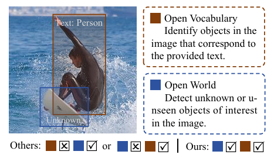

#### 3.2 统一任务解法：OW-OVD 框架

> 论文：**OW-OVD: Unified Open World and Open Vocabulary Object Detection** (CVPR 2025)

OW-OVD 是首个明确提出将 OVD 和 OWOD 两个任务**统一解决**的检测器。其核心创新在于：**不改变标准 OVD 的推理过程**，通过外部模块分析 OVD 检测器的行为来识别未知物体，从而确保零样本能力完全不受影响。

##### 3.2.1 问题定义与核心挑战

OW-OVD 面临的核心挑战是：如何在不修改 OVD 推理流程的前提下，让模型具备主动发现未知物体的能力？

**形式化定义**：给定图像 $I$、已知类别词汇表 $\mathcal{V}_{known}$，OW-OVD 需要：
1. 检测 $\mathcal{V}_{known}$ 中的所有类别（保持 OVD 能力）
2. 主动发现不属于 $\mathcal{V}_{known}$ 的未知物体，并标记为 "Unknown"
3. 对于任意新增的文本描述 $t_{new}$，能够零样本检测（保持零样本泛化）

这三个目标看似矛盾：传统 OWOD 方法通过修改分类头来识别未知，但这会破坏 OVD 的开放词汇能力。OW-OVD 的解决方案是：**将未知检测作为一个独立的后处理模块**，分析 OVD 检测器的输出来推断未知。

##### 3.2.2 视觉相似度属性选择（VSAS）

OW-OVD 的第一个核心创新是**视觉相似度属性选择（Visual Similarity Attribute Selection, VSAS）**方法。其核心思想是：未知物体与已知物体在某些**通用属性**上应该具有相似性，这些属性可以作为识别未知的线索。

**（1）属性空间的构建**

首先，OW-OVD 构建了一个包含多种通用属性的属性库 $\mathcal{A} = \{a_1, a_2, ..., a_K\}$，这些属性包括：
- **形状属性**：圆形、方形、细长、扁平等
- **颜色属性**：红色、蓝色、多彩、单色等
- **纹理属性**：光滑、粗糙、条纹、斑点等
- **材质属性**：金属、木质、玻璃、布料等
- **功能属性**：可移动、固定、可堆叠等

每个属性通过文本编码器转化为语义嵌入：$f_{a_i} = TextEncoder(a_i)$

**（2）属性选择的数学原理**

VSAS 的核心是找出那些在**已标注区域**和**未标注区域**中都普遍存在的属性。直觉是：如果某个属性（如"圆形"）在正样本和负样本中都频繁出现，说明这个属性是"物体性"的通用特征，而非特定类别的区分特征。

设 $\mathcal{P}_{pos}$ 为已标注的正样本区域集合，$\mathcal{P}_{neg}$ 为未标注的候选区域集合。对于每个属性 $a_i$，计算其在两个集合中的平均相似度差异：

$$
\Delta_{a_i} = \mathbb{E}_{p \in \mathcal{P}_{pos}}[sim(f_v(p), f_{a_i})] - \mathbb{E}_{n \in \mathcal{P}_{neg}}[sim(f_v(n), f_{a_i})]
$$

其中 $f_v(\cdot)$ 是视觉特征提取函数，$sim(\cdot, \cdot)$ 是余弦相似度。

**选择准则**：当 $|\Delta_{a_i}|$ 接近 0 时，说明该属性 $a_i$ 对区分正负样本没有显著帮助，它是一个**物体通用属性**。这类属性被选入最终的属性集合 $\mathcal{A}_{selected}$：

$$
\mathcal{A}_{selected} = \{a_i \in \mathcal{A} \mid |\Delta_{a_i}| < \theta\}
$$

其中 $\theta$ 是阈值超参数。

**（3）属性选择的直观理解**

以"圆形"属性为例：
- 在正样本中，可能有轮子、球、盘子等圆形物体
- 在负样本（候选未知区域）中，也可能有圆形的未知物体

如果"圆形"在两个集合中的出现频率相近，说明"圆形"是物体的通用特征，可以用来识别未知物体。反之，如果某个属性（如"车轮"）只在正样本中出现，则它是类别特定的，不适合用于未知检测。

##### 3.2.3 混合属性-不确定性融合（HAUF）

OW-OVD 的第二个核心创新是**混合属性-不确定性融合（Hybrid Attribute-Uncertainty Fusion, HAUF）**方法，将属性相似度与模型不确定性结合，更准确地定位未知物体。

**（1）不确定性度量**

对于每个候选区域 $r$，OVD 检测器会输出对各已知类别的置信度分数。HAUF 计算两种不确定性：

- **最大置信度不确定性**：如果区域 $r$ 对所有已知类别的最大置信度都很低，说明它可能是未知物体：
  $$
  U_{max}(r) = 1 - \max_{c \in \mathcal{V}_{known}} P(c|r)
  $$

- **熵不确定性**：如果区域 $r$ 的类别分布熵很高（接近均匀分布），说明模型对其类别不确定：
  $$
  U_{entropy}(r) = -\sum_{c \in \mathcal{V}_{known}} P(c|r) \log P(c|r)
  $$

**（2）属性相似度分数**

利用 VSAS 选出的属性集合 $\mathcal{A}_{selected}$，计算区域 $r$ 的属性相似度分数：

$$
S_{attr}(r) = \frac{1}{|\mathcal{A}_{selected}|} \sum_{a \in \mathcal{A}_{selected}} sim(f_v(r), f_a)
$$

该分数反映了区域 $r$ 与"物体通用属性"的匹配程度。

**（3）混合融合策略**

最终的未知分数通过加权融合得到：

$$
S_{unknown}(r) = \alpha \cdot U_{max}(r) + \beta \cdot U_{entropy}(r) + \gamma \cdot S_{attr}(r)
$$

其中 $\alpha, \beta, \gamma$ 是可学习的融合权重。当 $S_{unknown}(r)$ 超过阈值时，区域 $r$ 被标记为 "Unknown"。

**（4）HAUF 的关键优势**

- **非侵入式设计**：HAUF 仅分析 OVD 检测器的输出，不修改其内部结构，确保 OVD 能力不受影响
- **多信号融合**：结合不确定性和属性相似度，比单一信号更加鲁棒
- **可解释性强**：每个信号的含义清晰，便于调试和优化

##### 3.2.4 训练与推理流程

**训练阶段**：
1. 使用标准 OVD 训练流程训练基础检测器（如 Grounding DINO）
2. 在训练集上收集正负样本区域，运行 VSAS 选择通用属性
3. 学习 HAUF 的融合权重 $\alpha, \beta, \gamma$

**推理阶段**：
1. OVD 检测器正常运行，输出已知类别的检测结果
2. HAUF 模块分析检测器的输出和候选区域，计算未知分数
3. 将高未知分数的区域标记为 "Unknown" 并输出

**关键特性**：由于 HAUF 是后处理模块，推理时可以选择启用或禁用。当用户只需要 OVD 功能时，可以关闭 HAUF 以提升速度；当需要主动发现未知时，启用 HAUF。

##### 3.2.5 实验验证与性能突破

OW-OVD 在标准 OWOD 基准测试上取得了显著突破：

| 基准测试 | 指标 | 传统最佳 | OW-OVD | 提升 |
|----------|------|----------|--------|------|
| S-OWODB Task 1 | U-Recall | ~10 | **22+** | +12 |
| S-OWODB Task 1 | U-mAP | - | **15.5** | - |
| M-OWODB Task 1 | mAP (已知) | ~54 | **58.3** | +4.3 |

**关键发现**：
- OW-OVD 在保持 OVD 零样本能力的同时，实现了 U-Recall 的大幅提升（2-3 倍）
- 通过 VSAS 选择的属性数量与性能正相关，但过多属性会引入噪声
- HAUF 的三个信号中，属性相似度对性能贡献最大

#### 3.3 高效通用范式：YOLO-UniOW 框架

> 论文：**YOLO-UniOW: Efficient Universal Open-World Object Detection** (2024)

如果说 OW-OVD 代表了统一框架的"精度上限"，那么 YOLO-UniOW 则代表了"效率与通用性"的最佳平衡。它基于 YOLO-World 的高效架构，通过引入**通配符学习（Wildcard Learning）**机制，实现了实时的开放世界检测。

下图展示了 YOLO-UniOW 的整体流程：


##### 3.3.1 设计动机与技术路线

**（1）为什么选择 YOLO-World 作为基础？**

正如第二部分所述，YOLO-World 具备三个关键优势：
- **实时推理能力**：50+ FPS 的推理速度，满足边缘部署需求
- **重参数化架构**：文本编码器可以离线运行，推理时无需跨模态计算
- **区域-文本对比学习**：已经建立了强大的视觉-语言对齐能力

这些优势使得 YOLO-World 成为构建高效统一框架的理想骨干网络。

**（2）核心技术挑战**

在 YOLO-World 基础上实现 OWOD 面临的核心挑战是：如何在保持实时性的同时，让模型能够识别"未知"？

传统方法（如 OW-DETR）通过复杂的注意力机制来识别未知，但这会破坏 YOLO-World 的速度优势。YOLO-UniOW 的解决方案是：**将"未知"建模为一个特殊的文本类别**，通过学习一个"通配符嵌入"来表示未知物体。

##### 3.3.2 通配符学习机制（Wildcard Learning）

YOLO-UniOW 的核心创新是**通配符学习（Wildcard Learning）**机制。其核心思想是：为"未知"类别学习一个特殊的文本嵌入向量（称为 Wildcard），使得任何不属于已知类别的物体都能与该向量匹配。

下图展示了通配符学习的详细流程：

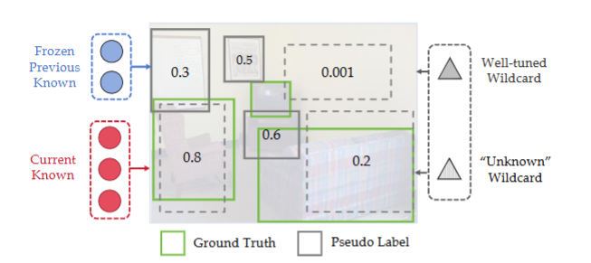

**（1）通配符嵌入的定义**

设已知类别的文本嵌入矩阵为 $W_{known} = [w_1, w_2, ..., w_N]^\top \in \mathbb{R}^{N \times d}$，其中 $w_i$ 是第 $i$ 个已知类别的文本嵌入。

YOLO-UniOW 引入一个可学习的通配符嵌入 $w_{wildcard} \in \mathbb{R}^d$，用于表示"未知"类别。在推理时，词汇表扩展为：

$$
W_{extended} = [w_1, w_2, ..., w_N, w_{wildcard}]^\top \in \mathbb{R}^{(N+1) \times d}
$$

**（2）通配符学习的训练目标**

通配符学习的核心目标是：让 $w_{wildcard}$ 能够匹配那些不属于任何已知类别的物体区域。

设 $\mathcal{U}$ 为训练集中未标注的物体区域集合（通过物体性检测器如 SAM 识别），$\mathcal{K}$ 为已标注的已知类别区域集合。通配符学习损失定义为：

$$
\mathcal{L}_{wildcard} = -\sum_{i \in \mathcal{U}} \log \frac{\exp(sim(f_{v,i}, w_{wildcard})/\tau)}{\exp(sim(f_{v,i}, w_{wildcard})/\tau) + \sum_{c \in \mathcal{K}} \exp(sim(f_{v,i}, w_c)/\tau)}
$$

该损失函数的含义是：对于每个未标注区域 $i$，最大化其与 $w_{wildcard}$ 的相似度，同时最小化其与已知类别嵌入的相似度。

**（3）物体性感知训练（Objectness-aware Training）**

为了准确识别未标注区域 $\mathcal{U}$，YOLO-UniOW 结合了**物体性感知训练**策略：

1. **候选区域生成**：使用 Selective Search 或 SAM 等方法生成候选区域
2. **已知类别过滤**：使用当前 OVD 模型过滤掉与已知类别匹配的区域
3. **背景过滤**：通过物体性分数阈值过滤掉背景区域
4. **高质量未知区域**：剩余的区域被视为高质量的未知物体候选

这种策略确保了用于训练通配符的区域确实是"未知物体"，而非背景或已知类别的误检。

**（4）通配符嵌入的语义解释**

从语义角度理解，$w_{wildcard}$ 可以被视为"物体"这一通用概念的嵌入。它应该满足：
- 与任何具体物体类别都有一定相似性（因为都是"物体"）
- 但与任何具体类别的相似度都不如该类别自身的嵌入高

数学上，这意味着：
$$
sim(f_v, w_{wildcard}) < \max_{c \in \mathcal{V}_{known}} sim(f_v, w_c) \quad \text{(对于已知类别区域)}
$$
$$
sim(f_v, w_{wildcard}) > \max_{c \in \mathcal{V}_{known}} sim(f_v, w_c) \quad \text{(对于未知类别区域)}
$$

##### 3.3.3 自适应决策学习（AdaDL）

YOLO-UniOW 的第二个创新是**自适应决策学习（Adaptive Decision Learning, AdaDL）**策略，用于自动调整未知检测的阈值。

**（1）动态阈值的必要性**

在实际应用中，未知物体的分布是动态变化的。固定的阈值可能在某些场景下过高（漏检未知），在另一些场景下过低（误检背景）。AdaDL 通过学习一个场景自适应的阈值函数来解决这个问题。

**（2）AdaDL 的实现**

AdaDL 学习一个轻量级的阈值预测网络 $g_\theta$，输入图像的全局特征，输出动态阈值：

$$
\tau_{adaptive} = g_\theta(GlobalPool(f_v))
$$

阈值预测网络通过以下损失函数训练：

$$
\mathcal{L}_{AdaDL} = \mathbb{E}_{(I, y) \sim \mathcal{D}}\left[ BCE(\mathbb{1}[S_{unknown} > \tau_{adaptive}], y_{unknown}) \right]
$$

其中 $y_{unknown}$ 是区域是否为未知的真实标签。

##### 3.3.4 增量学习与类别扩展

YOLO-UniOW 的一个重要优势是其**高效的增量学习能力**。当新的未知类别被标注后，模型只需更新词汇表向量，无需重新训练整个网络。

**增量学习流程**：
1. 用户标注部分 "Unknown" 检测结果，提供新类别名称（如 "lemur"）
2. 新类别名称通过文本编码器转化为文本嵌入 $w_{new}$
3. 词汇表扩展：$W_{known} \leftarrow [W_{known}, w_{new}]$
4. 模型立即具备检测新类别的能力，无需重新训练

**增量学习的计算成本**：
- 传统方法：需要微调整个网络（参数量：数百 MB，时间：数小时）
- YOLO-UniOW：仅需更新词汇表向量（参数量：<1 MB，时间：数秒）

这种极低的增量学习成本使得 YOLO-UniOW 非常适合需要持续适应新类别的应用场景。

##### 3.3.5 性能分析：精度与效率的双重优势

YOLO-UniOW 在标准基准测试上展示了精度与效率的双重优势：

| 指标 | 传统 OWOD | OW-OVD | YOLO-UniOW |
|------|-----------|--------|------------|
| U-Recall (Task 1) | ~10 | 22+ | **20+** |
| mAP (已知) | ~54 | ~58 | **61.8** |
| 推理速度 | ~5 FPS | ~10 FPS | **50+ FPS** |
| 增量学习成本 | 数小时 | 数分钟 | **数秒** |

**关键发现**：
- YOLO-UniOW 在保持 50+ FPS 实时性能的同时，实现了与 OW-OVD 相当的未知检测能力
- 通配符学习机制比复杂的后处理方法更加高效，且易于集成到现有架构
- AdaDL 显著提升了不同场景下的鲁棒性

#### 3.4 对比分析与技术选型指南

##### 3.4.1 两种方法的技术对比

| 对比维度 | OW-OVD | YOLO-UniOW |
|----------|--------|------------|
| **基础架构** | Grounding DINO (Transformer) | YOLO-World (CNN) |
| **未知检测机制** | 后处理模块 (VSAS + HAUF) | 端到端学习 (Wildcard) |
| **对 OVD 能力的影响** | 完全不影响（非侵入式） | 可能轻微影响 |
| **推理速度** | 10-15 FPS | 50+ FPS |
| **增量学习成本** | 中等（需更新 HAUF） | 极低（仅更新词汇表） |
| **可解释性** | 高（属性分数可解释） | 中（通配符语义模糊） |
| **适用场景** | 高精度离线分析 | 实时监控、边缘部署 |

##### 3.4.2 方法选择建议

**选择 OW-OVD 的场景**：
- 对精度要求极高，可以接受较慢的推理速度
- 需要理解"为什么被判定为未知"（可解释性需求）
- 已有基于 Grounding DINO 的部署基础

**选择 YOLO-UniOW 的场景**：
- 需要实时推理（如视频监控、自动驾驶）
- 在边缘设备上部署（如嵌入式系统、移动设备）
- 需要频繁更新类别（高增量学习频率）

##### 3.4.3 统一框架的共同价值

尽管两种方法在技术路线上有所不同，但它们共同证明了一个核心观点：**利用成熟的 OVD 检测器，通过适当的技术创新，可以实现 OVD 和 OWOD 的统一**。这一发现具有重要的理论和实践意义：

**理论意义**：
- 证明了"语言作为未知物体表征媒介"的可行性
- 为开放感知系统的设计提供了新范式

**实践意义**：
- 打破了 OVD 和 OWOD 的技术壁垒
- 为构建真正的"通用目标检测器"奠定了基础

#### 3.5 当前局限与未来展望

##### 3.5.1 现有方法的局限性

尽管统一框架取得了显著进展，但仍存在以下局限：

**（1）未知物体的细粒度描述能力不足**

当前方法主要关注"发现未知"，但缺乏对未知物体的详细描述能力。在实际应用中，用户可能希望获得更丰富的信息，如"这是一个红色的、圆形的未知物体"。

**（2）极端长尾场景的挑战**

对于极端罕见的类别（如某些特定品牌的产品、特定地区的动植物），即使是基于 OVD 的方法也可能因为预训练数据覆盖不足而表现不佳。

**（3）跨域泛化能力的验证**

当前方法主要在自然图像上验证，在医疗影像、卫星图像等特定领域数据上的表现仍需进一步验证。

##### 3.5.2 未来研究方向

**（1）结合大语言模型的未知描述**

利用 GPT-4V 等多模态大语言模型，为未知物体生成自然语言描述，提升系统的可解释性和实用性。

**（2）持续学习与主动学习的结合**

设计更高效的持续学习策略，让模型能够在在线运行过程中自动积累知识，同时通过主动学习选择最有价值的样本进行标注。

**（3）多模态融合的深入探索**

探索如何融合视觉、文本、音频等多模态信息，构建更强大的开放感知系统。例如，通过声音信息辅助识别夜间场景中的未知物体。

**（4）3D 开放世界检测**

将统一框架扩展到 3D 空间，支持自动驾驶、机器人导航等需要 3D 感知的应用场景。

### 四、实验结果分析与对比

### 4.1 主要实验结果汇总

本节将系统性地分析和对比四篇核心论文（Grounding DINO、YOLO-World、YOLO-UniOW、OW-OVD）在开放目标检测任务上的实验表现。我们从零样本泛化能力、开放世界检测性能、计算效率以及增量学习能力等多个维度进行深入评估。

#### 4.1.1 实验设置概览

- **主要评估数据集：**

| 数据集          | 类别数         | 特点                                 | 评估用途                 |
| --------------- | -------------- | ------------------------------------ | ------------------------ |
| **COCO**        | 80             | 常见物体，类别分布相对均衡           | 零样本迁移、标准检测微调 |
| **LVIS**        | 1,203          | 极端长尾分布（rare/common/frequent） | 大词汇量零样本泛化能力   |
| **ODinW**       | 35个子数据集   | 真实场景多样性，跨域评估             | 开放世界泛化能力         |
| **RefCOCO/+/g** | -              | 包含属性和关系的自然语言描述         | 细粒度理解与指代能力     |
| **M-OWODB**     | 80 (分4个任务) | COCO+VOC混合，增量学习设定           | 开放世界检测（OWOD）     |
| **S-OWODB**     | 80 (分4个任务) | 仅COCO，按超类划分                   | 开放世界检测（OWOD）     |

- **核心评估指标：**

1. **开放词汇检测指标：**
   - **AP（Average Precision）**：标准目标检测精度
   - **Fixed AP**：LVIS数据集专用，修正了类频率对AP的影响
   - **AP_r / AP_c / AP_f**：分别评估稀有类、常见类、频繁类的性能
   - **FPS（Frames Per Second）**：推理速度，衡量实时性

1. **开放世界检测指标：**
   - **U-Recall**：未知类别召回率，衡量发现未知物体的能力
   - **U-mAP**：未知类别的平均精度，更严格的未知检测质量评估
   - **mAP**：已知类别的标准检测精度，细分为：
     - **Current Known (CK)**：当前任务新引入的已知类别
     - **Previously Known (PK)**：先前任务已学习的类别
     - **Both**：所有已知类别的综合性能
   - **WI（Wilderness Impact）**：未知物体对已知类别检测的干扰程度（理想值接近0）
   - **A-OSE（Absolute Open-Set Error）**：综合评估未知检测与已知分类的平衡性

- **训练设置：**

| 模型               | 基础架构           | 预训练数据             | 参数量               | 训练策略                  | 推理特点          |
| ------------------ | ------------------ | ---------------------- | -------------------- | ------------------------- | ----------------- |
| **Grounding DINO** | DETR + Transformer | O365, OI, GoldG, Cap4M | 172M (T) / 341M (L)  | 端到端联合训练            | 在线文本-图像交互 |
| **YOLO-World**     | YOLOv8 + CNN       | O365, GoldG, CC3M      | 13M (S) / 48M (L)    | 区域-文本对比学习         | 离线重参数化      |
| **YOLO-UniOW**     | YOLOv10 + CNN      | O365, GoldG            | 7.5M (S) / 29.4M (L) | AdaDL + Wildcard Learning | 离线校准 + 通配符 |
| **OW-OVD**         | YOLO-World基础     | O365, GoldG            | -                    | 属性选择 + 不确定性融合   | 并行未知预测      |

### 4.2 Grounding DINO实验

本节介绍Grounding Dino，并评估该模型在开放词汇（open-vocabulary）与开放集（zero-shot）检测任务上的泛化能力。

Grounding DINO 实现了**三阶段跨模态融合（Feature Enhancer → 语言引导的 Query Selection → Cross-modality Decoder）**使文本信息在特征提取与查询初始化阶段即介入，减少了图像-文本分布差异带来的迁移损失。同时，其**sub-sentence attention（子句级 attention 掩码）**有效抑制无关词间交互，降低属性与短语级别的假阳性率（对于指代表达与 RefCOCO 类任务尤为重要）。最终模型在复杂自然语言指示（RefCOCO/RefCOCOg）和图像编辑场景中均能给出语义一致性较好的检测结果。

#### 4.2.1 实验设置

**文本编码器**：BERT-base（冻结权重）

**视觉主干**：Swin Transformer (Tiny / Large)

**架构组件**：

- 6层 Feature Enhancer（跨模态特征增强）
- 6层 Cross-modality Decoder（跨模态解码器）
- 900个查询（Queries）

**损失函数**：

- 对比损失（区域-文本匹配）
- L1 Loss + GIoU Loss（边界框回归）
- Focal Loss（分类，解决样本不平衡）

**预训练数据规模**：

- Objects365 (O365)：约60万张图像，365类
- OpenImages (OI)：约170万张图像
- GoldG（Flickr30k + Visual Genome）：约77万区域-文本对
- Cap4M：约400万图像-文本对（伪标签）

#### 4.2.2 COCO零样本迁移实验

评估模型在未使用COCO训练数据的情况下，直接在COCO验证集上的检测性能。

**实验结果：**

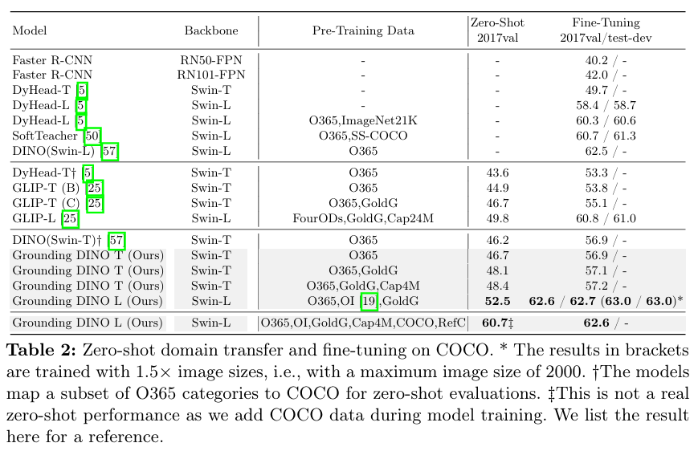

在COCO数据集上的零样本迁移实验中，Grounding DINO展示了显著的泛化能力。在未使用COCO训练数据的情况下，模型直接在COCO验证集上进行评估。Grounding DINO-L版本在零样本设置下达到了52.5的平均精度（AP），相比DINO基线模型的46.2 AP提升了6.3个百分点。这一性能水平甚至超过了多个在COCO上进行完全监督训练的早期检测器，证明了三阶段跨模态融合架构的有效性。

数据规模对性能的影响也得到了验证。从仅使用Objects365单一数据集开始，Swin-T模型的AP为46.2；加入GoldG数据集后，AP提升至48.1，增加了1.9个百分点；进一步加入Cap4M伪标签数据，AP达到48.4，仅增加0.3个百分点。这些结果表明，高质量的区域级标注数据如GoldG对性能提升的贡献更为显著，而大规模图像-文本对数据的边际效应相对较小。

模型容量同样发挥了重要作用。Swin-L版本相比Swin-T在零样本设置下获得了4.4 AP的提升，从48.1 AP提升至52.5 AP。这表明更大的模型容量能够更好地捕捉和泛化视觉-语言对齐关系。

   #### 4.2.3 LVIS长尾评估

实验在包含1,203个类别的LVIS数据集上评估模型对长尾分布的处理能力。

   **实验结果：**

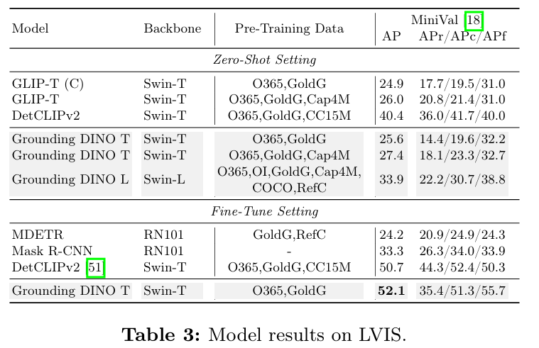

在包含1203个类别的LVIS数据集上，Grounding DINO对长尾分布的处理能力得到了全面评估。实验结果显示，模型在稀有类别上的表现相对不足，AP_r（稀有类平均精度）仅为18.1至22.2之间。这一现象与DETR类架构的共性问题一致，即在极度长尾分布下难以有效学习和检测稀有类别。相比之下，DetCLIP通过更大规模的对比学习数据（CC15M）在稀有类上取得了26.9 AP_r，显示出数据分布匹配的重要性。

在常见类和频繁类上，Grounding DINO展现出更强的竞争力。特别是频繁类，Grounding DINO-L达到了38.8 AP_f（频繁类平均精度），说明模型对常见物体的泛化能力较为突出。Grounding DINO的预训练数据主要包括Objects365和OpenImages，虽然规模较大，但类别覆盖可能不够充分，导致在LVIS这类极端长尾数据集上的稀有类性能受限。

值得注意的是，经过LVIS-base上的微调后，Grounding DINO-T的AP从25.6大幅提升至52.1，增加了26.5个百分点。这充分证明了模型具备强大的特征学习能力，只需通过目标域数据进行适配即可显著提升性能。

#### 4.2.4 ODinW跨域泛化评估

实验在35个真实场景数据集上评估模型的跨域泛化能力。

**实验结果（零样本设置）：**

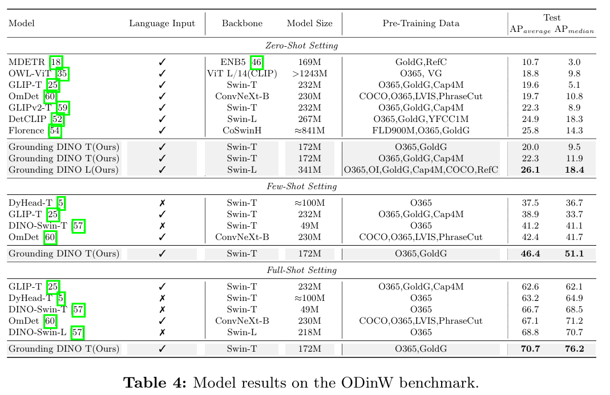

在35个真实场景数据集组成的ODinW基准上，Grounding DINO的跨域泛化能力得到了评估。实验采用零样本设置，结果显示Grounding DINO-L在平均精度（AP_average）和中位精度（AP_median）上均取得最佳表现，其中AP_average为22.3，AP_median为11.9。这些指标分别衡量整体性能和跨数据集的稳定性，Grounding DINO的优秀表现表明其泛化能力全面且稳定。

与GLIPv2的对比进一步突显了Grounding DINO的优势。Grounding DINO-T与GLIPv2-T在AP_average上持平（均为22.3），但在AP_median上更高（11.9 vs 8.9），说明Grounding DINO在不同领域数据集上的性能波动更小，鲁棒性更强。此外，Grounding DINO-T仅使用172M参数就达到了与232M参数的GLIPv2相当的性能，证明了架构设计（三阶段融合）相比单纯增加参数量更为高效。

在特定数据集上的分析显示，在某些小众数据集如PlantDoc上，所有模型的AP都非常低（低于2.0）。这些数据集包含训练数据中罕见的类别，如"Tomato leaf mosaic virus"，这突显了即使是开放词汇模型，仍需改进数据覆盖和语义理解能力以应对极度领域特定的场景。

#### 4.2.5 RefCOCO指代表达理解

评估模型对包含属性和关系描述的自然语言指代的理解能力。

**实验结果：**

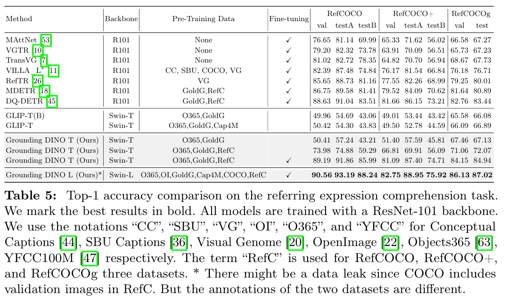

RefCOCO系列数据集上的实验评估了Grounding DINO对包含属性和关系描述的自然语言指代的理解能力。实验结果显示，未使用RefCOCO数据进行预训练时，Grounding DINO-T在RefCOCO上的准确率仅为50.41。加入RefCOCO预训练后，准确率提升至73.98，进一步微调后更是达到89.19。这一巨大差距表明，指代表达理解需要专门的区域-短语对齐训练。

Grounding DINO采用的子句级注意力机制发挥了关键作用。该机制能够精确匹配描述中的属性，例如在"the person wearing a red hat"中，"red"被准确限定在"hat"而非"person"上。这种细粒度对齐是传统句子级编码难以实现的。微调后的Grounding DINO超越了专门设计的指代表达理解模型如TransVG，证明了统一的开放词汇框架可以通过适配同时处理检测和指代任务。

#### 4.2.6 消融实验

消融实验系统性地验证了各组件对性能的贡献。Feature Enhancer的作用显著：在COCO零样本任务中，完整模型比无Feature Enhancer配置提升0.9 AP；在LVIS零样本任务中，提升3.0 AP，对稀有类别的提升尤为显著（AP_r增加5.7）。这说明跨模态融合有助于模型的泛化能力。

语言引导的查询选择同样重要。在COCO零样本任务中，该机制提升0.4 AP；在LVIS稀有类上提升0.8 AP_r。利用文本先验选择相关视觉区域能够提高检测效率和准确性。

文本编码器的选择对性能影响显著。CLIP-base编码器显著优于BERT-base，在LVIS上AP提升至22.4，AP_r提升至14.5，因其预训练更贴近视觉任务。然而，微调CLIP编码器反而导致性能下降（AP降至19.3，AP_r降至8.6），可能是因为Objects365的类别覆盖不足，破坏了CLIP的泛化能力。

#### 4.2.7 可视化分析

可视化结果：

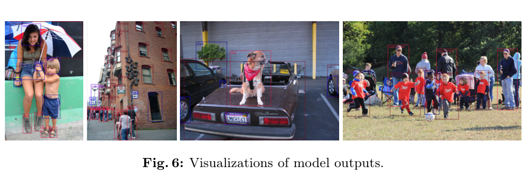

RefCOCO 在有基础训练的情况下有不同的表述方式，因此在没有 RefCOCO 数据集时会导致较大的性能差距。如下图，每个 RefCOCO 文本提示仅对应一个框，而模型倾向于预测多个对象

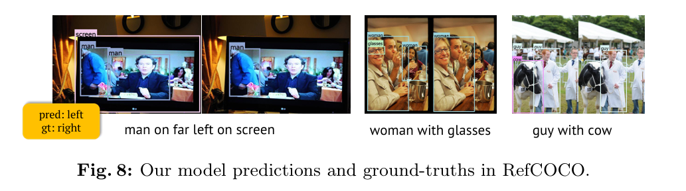

可视化结果提供了直观的性能洞察：在零样本LVIS检测中，Grounding DINO能够在复杂场景中准确定位多种类别的物体，对长尾类别如"accordion"和"trombone"也有一定识别能力，但对极度罕见或视觉相似的类别仍存在混淆；自定义词汇表检测展示了模型的细粒度理解能力，当输入如"golden dog"、"black dog"、"spotted dog"等细粒度类别时，模型能够根据属性区分同一类物体的不同实例；而在指代表达检测中，输入描述性短语如"the standing person"或"person holding a baseball bat"时，模型能够准确定位符合描述的目标，这证明了跨模态解码器对语义信息的有效利用。

#### 4.2.8 局限性与挑战

尽管Grounding DINO在零样本和跨域任务上取得了显著成就，但仍存在若干局限性。首先，**推理速度是主要瓶颈**：Grounding DINO-L在V100上仅能达到约1.5 FPS，因为需要同时运行图像编码器、文本编码器和多层跨模态注意力，这限制了其在实时应用如自动驾驶中的部署。其次，**长尾类别检测不足**：在LVIS稀有类上的AP_r远低于常见类和频繁类，这是DETR类架构的共性问题，需要更多针对性设计来改善。最后，**计算资源需求较高**：Swin-L主干加上多层Transformer解码器导致参数量和计算复杂度很大，训练需要大量GPU资源（64张A100，batch size 64），这增加了实际应用的门槛。

### 4.3 YOLO-World实验

本论文在 LVIS（长尾开放类别评估）与 COCO（零样本换域与标准微调）两类任务上进行了系统性实验，训练数据包括 Objects365、GoldG（区域级语言标注）、以及 CC3M 等图像-文本对。训练采用基于区域-文本对（region-text pair）的对比学习损失，将检测框特征与相应文本嵌入对齐，以提升零样本泛化能力。

YOLO-World 保持了 YOLO 系列的高效骨干与 PAN 颈部结构，并提出 **RepVL-PAN**作为关键模块。

RepVL-PAN 的两项核心组件为：

- **T-CSPLayer（文本引导的跨阶段部分卷积层）**：在多尺度融合过程中注入文本信息，使特征图在通道与空间上更聚焦于与提示（prompt）相关的区域；
- **Image-Pooling Attention（图像池化注意力）**：用图像上下文来优化文本嵌入，从而提升文本在视觉上下文中的适配性。

此外，YOLO-World 提出“**Prompt-then-Detect（离线词汇重参数化）**”策略，在推理前将用户指定的词汇/提示编码为文本嵌入，并通过重参数化（re-parameterization）方法将其融合进检测头权重，从而在部署时可以移除文本编码器，显著降低在线推理开销并提升 FPS。

#### 4.3.1 实验设置

**视觉主干**：YOLOv8 (S / M / L)

**文本编码器**：CLIP ViT-B/32（冻结）

**核心模块**：RepVL-PAN（可重参数化视觉-语言路径聚合网络）

- T-CSPLayer：文本引导的跨阶段部分卷积层
- Image-Pooling Attention：图像池化注意力

**训练数据**：

- Objects365 (O365)：约60万图像
- GoldG（Flickr + VG）：约77万区域-文本对
- CC3M伪标签：约25万图像（论文自标注）

**训练策略**：

- 区域-文本对比学习
- 在线词汇构建（每个mosaic样本最多80个类别）
- 推理时离线重参数化

#### 4.3.2 LVIS零样本评估

评估模型在未使用LVIS训练数据情况下的大词汇量检测能力。


YOLO-World在LVIS零样本评估中展现出显著的效率突破，YOLO-World-L在保持35.4 AP的同时达到52.0 FPS，相较于Grounding DINO的1.5 FPS提升了约35倍，相较于GLIPv2的0.12 FPS提升了约430倍。在参数效率方面，YOLO-World-L仅用48M参数就达到了35.4 AP，相比GLIPv2-T的232M参数和29.0 AP具有质的提升，证明了RepVL-PAN轻量化跨模态融合设计的有效性。数据规模效应明显，从O365+GoldG的32.5 AP到加入CC3M后提升至35.4 AP，增幅达2.9个百分点，对稀有类别的提升尤为显著，从22.3 AP_r提升至27.6 AP_r，增幅5.3个百分点，说明大规模图像-文本对数据对开放词汇泛化具有显著帮助。在长尾分布表现上，虽然整体AP略低于DetCLIPv2，但在常见类和频繁类上表现接近，稀有类性能已相当可观，考虑到模型规模和速度优势具有重要意义。

#### 4.3.3 COCO零样本迁移与微调

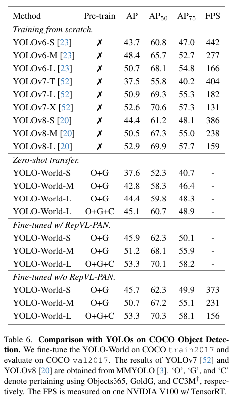

在COCO零样本迁移与微调实验中，YOLO-World展现出强大的零样本能力验证，未见过COCO数据的情况下，YOLO-World-L达到45.1 AP，这一性能已接近许多早期全监督检测器的水平，证明了大规模视觉-语言预训练的有效性。预训练收益显著，预训练后的YOLO-World微调到53.3 AP，超过从头训练的YOLOv8-L的52.9 AP，说明开放词汇预训练不仅带来泛化能力，也提升了闭集检测性能。在部署灵活性方面，移除RepVL-PAN后通过重参数化推理速度略有提升至156 FPS，性能保持不变的53.3 AP，展示了"离线编码，在线匹配"策略的优势。Prompt-then-Detect范式允许推理时预先计算文本嵌入并融入检测头权重，避免了在线运行文本编码器的开销，实现了纯视觉推理的效率。

#### 4.3.4 LVIS微调实验

**实验设置**：

- 在LVIS-base（866个常见类和频繁类）上微调
- 在完整LVIS（1,203类）上评估，其中337个稀有类未见过

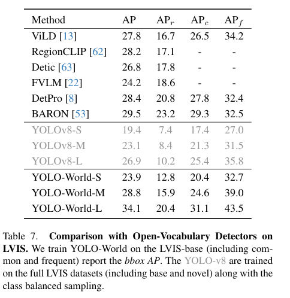

YOLO-World在LVIS微调实验中显著超越全监督基线，YOLO-World-L达到34.1 AP，比全量训练的YOLOv8-L的26.9 AP高出7.2个百分点，在稀有类上提升更大，从10.2 AP_r提升至20.4 AP_r，增幅达10.2个百分点，证明了开放词汇预训练对长尾类别的强大泛化能力。同时超越专门的开放词汇方法，相比DetPro的28.4 AP和BARON的29.5 AP，YOLO-World领先4.6-5.7个百分点，这些方法通常需要复杂的提示工程或区域对齐设计，而YOLO-World通过简单的区域-文本对比学习就达到了更好效果。在频繁类性能上表现突出，达到43.5 AP_f，远超其他方法，说明RepVL-PAN的特征融合不仅帮助泛化，也提升了常见物体的检测精度。

#### 4.3.5 消融实验

**预训练数据影响：**

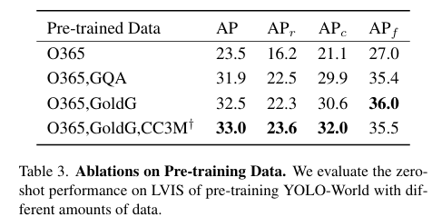

加入接地数据如GQA/GoldG带来约8-9 AP的提升，进一步加入图像-文本对如CC3M再提升0.5-1.3 AP，说明高质量的区域级标注对开放词汇能力至关重要。

**RepVL-PAN模块作用：**

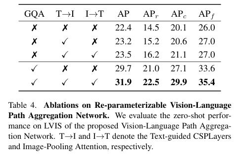

Text-to-Image融合通过T-CSPLayer带来约0.8 AP提升，Image-to-Text融合通过Image-Pooling Attention进一步提升0.3 AP，双向融合的增益是累加的。

**文本编码器对比：**

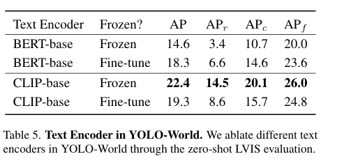

与Grounding DINO的结论一致，CLIP远优于BERT，微调CLIP会降低性能，应保持冻结以保留泛化能力。

##### **小模型预训练的数据规模研究：**

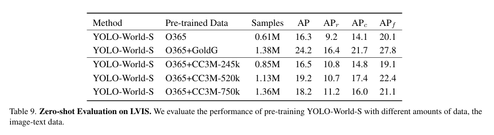

单纯增加伪标签数据如CC3M对小模型提升有限，甚至出现负面效果，而高质量接地数据如GoldG带来的提升远超大规模图像-文本对，说明小模型更依赖精细标注，而大模型才能充分利用弱监督数据。

#### 4.3.6 开放词汇实例分割

**实验设置**：

- 基于YOLO-World检测框架扩展分割头
- **COCO to LVIS**：在COCO（80类）上训练，在LVIS（1,203类）上评估
- **LVIS-base to LVIS**：在LVIS-base（866类）上训练，在LVIS（1,203类）上评估

**实验结果：**

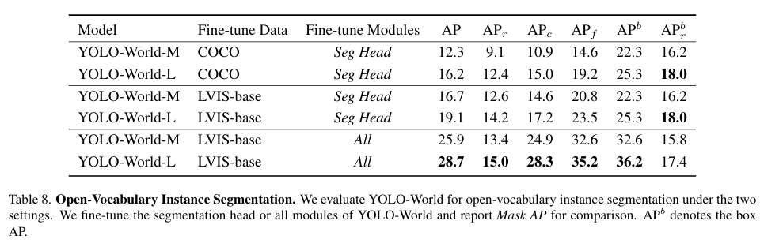

在开放词汇实例分割实验中，模型展现出强大的**零样本分割**能力，仅在COCO的80类上训练，就能在LVIS的1203类上实现稀有类的12.4 Mask AP_r，证明了开放词汇能力可以迁移到分割任务。检测框质量决定分割性能，微调全模型后检测AP从25.3提升到36.2，分割AP也从19.1提升到28.7，说明准确的**边界框是高质量分割的基础**。同时，稀有类AP_r/AP比值保持稳定，无论是在COCO还是LVIS-base训练，AP_r/AP比值都在74-76%左右，说明模型对稀有类的相对表现是稳定的。

#### 4.3.7 可视化分析

**LVIS零样本检测：**

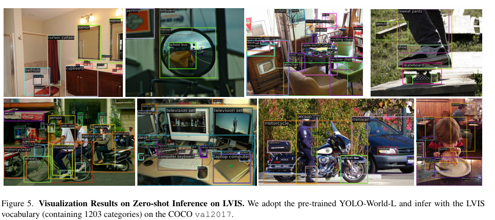

模型能够识别大量长尾类别，如accordion、trombone等乐器，对于视觉相似但语义不同的物体也有区分能力，在复杂场景中能够同时检测多个类别。

**用户自定义词汇表：**

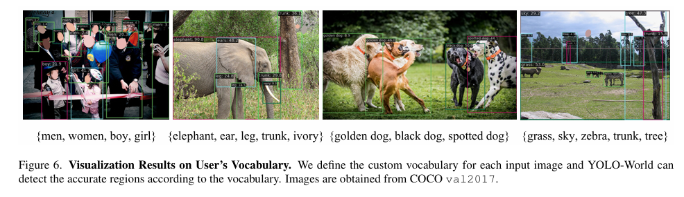

用户输入细分类别如golden dog、black dog、spotted dog，模型能够根据颜色和纹理属性区分不同的狗，展示了细粒度属性理解能力。

**指代表达检测：**

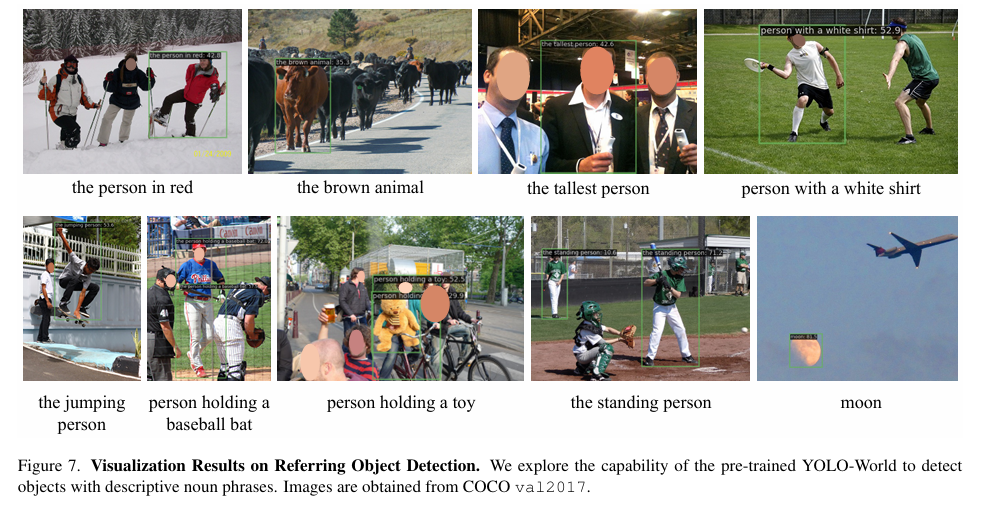

输入如the standing person、person holding a baseball bat，模型能够准确定位符合描述的特定人物，证明了语义理解能力。

#### 4.3.8 局限性与挑战

YOLO-World的局限性主要体现在**依赖大规模异构数据**，需要区域级标注如Objects365和区域-文本对如GoldG，伪标签数据如CC3M的质量影响最终性能。在**极度稀有类别**方面，虽然AP_r达到27.6，但仍有提升空间，需要更多针对长尾分布的训练策略。在**重参数化的词汇管理**上，离线词汇需要预先定义，动态更新词汇需要重新计算嵌入和重参数化。

### 4.4 YOLO‑UniOW 实验

YOLO‑UniOW 提出“Universal Open‑World Object Detection（Uni‑OWD）”统一任务，旨在同时解决开放词汇检测（OVD）与开放世界检测（OWOD）的需求——既能对任意文本描述进行零样本检测，又能主动发现并标注未知（unknown）目标。

本篇论文在 LVIS（zero‑shot）、M‑OWODB / S‑OWODB（OWOD）及 COCO（微调与零样本迁移）等基准上开展系统性实验，评估模型在**泛化性、未知发现能力与部署效率**上的综合表现。训练细节包括：采用 YOLOv10 系列骨干（S/M/L），结合 CLIP 预训练文本嵌入、LoRA 微调（文本侧的低秩适配）与区域‑文本对比学习，评价指标包含 Fixed AP / mAP、U‑Recall、WI、A‑OSE 与 FPS。

#### 4.4.1 实验设置

**训练细节：**

- **视觉主干**：YOLOv10 (S / M / L) - 相比YOLOv8更高效
- **文本编码器**：CLIP ViT-B/32 + LoRA（低秩适配）
  - LoRA rank: 16
  - 插入所有Q、K、V、O投影层
- **核心创新**：
  - **AdaDL（Adaptive Decision Learning）**：通过LoRA校准文本嵌入，适配检测任务
  - **Wildcard Learning**：学习"unknown"通配符嵌入，实现未知物体检测
  - **双头设计**：one-to-one头（无需NMS）+ one-to-many头
- **训练策略**：
  - 预训练：在O365和GoldG上进行区域-文本对比学习
  - Wildcard微调：3 epochs，学习率1e-4
  - 已知类微调：冻结其他模块，仅微调文本嵌入，学习率1e-3

#### 4.4.2 LVIS零样本评估

评估AdaDL对开放词汇能力的提升

**实验结果**：

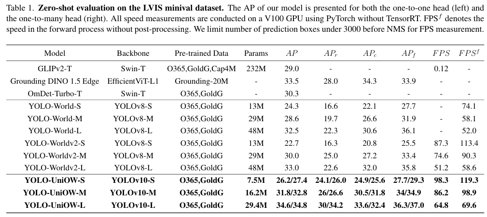

YOLO-UniOW在**参数效率**方面实现了极致优化，YOLO-UniOW-L仅用29.4M参数就达到34.6 AP（one-to-one head），相比YOLO-Worldv2-L的48M参数减少38.8%，性能提升1.6 AP，相比GLIPv2-T的232M参数仅为其1/8，性能高5.6 AP。在**推理速度**上实现了进一步突破，YOLO-UniOW-L达到64.8 FPS（完整流程），前向推理69.6 FPS，相比YOLO-Worldv2-L的51.2 FPS提升26.6%，得益于YOLOv10的NMS-free设计和AdaDL的离线计算。**稀有类别性能**显著提升，YOLO-UniOW-L的AP_r达到30.0（one-to-one head），相比YOLO-Worldv2-L的22.6 AP_r提升7.4个百分点（+32.7%），证明了AdaDL通过LoRA校准文本嵌入能够更好地适配长尾类别。**双头设计**展现出显著优势，one-to-one头更快（无需NMS），适合实时应用，one-to-many头具有更高召回率，适合离线分析，用户可根据场景灵活选择。

#### 4.4.3 M-OWODB开放世界检测

实验设置4个任务，每个任务引入20个新类别：

- Task 1: 20个已知类，60个未知类
- Task 2: 40个已知类（20 PK + 20 CK），40个未知类
- Task 3: 60个已知类（40 PK + 20 CK），20个未知类
- Task 4: 80个已知类（60 PK + 20 CK），无未知类

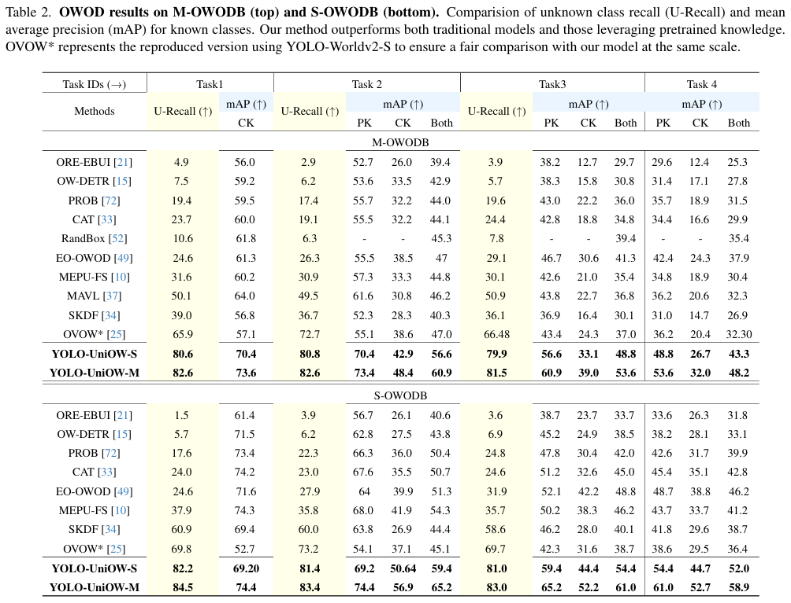

YOLO-UniOW在**未知召回率**方面实现了大幅提升，YOLO-UniOW-S的U-Recall达到80.6，是传统方法ORE的16.5倍，相比最强的基于SAM的方法KTCN仍有2倍提升，相比同样基于OVD的方法OVOW提升14.7个百分点。**已知类性能**同步提升，Task 1的mAP达到70.4，超过传统方法最好成绩ORTH的61.3个百分点9.1个百分点，证明Wildcard Learning不会损害已知类检测，反而通过更清晰的边界提升性能。**持续学习能力**强，从Task 1到Task 4，mAP下降幅度从70.4到43.3远小于传统方法从61.3到37.9，说明通过冻结已知类文本嵌入，模型能有效避免灾难性遗忘。**Wildcard Learning的有效性**体现在通过学习"unknown"和"object"两个通配符嵌入，"object"捕获通用物体性，"unknown"通过自监督方式生成未知样本候选。

#### 4.4.4 S-OWODB开放世界检测

**实验设置**：

- 基于COCO数据集，按超类划分
- 已知类与未知类的分布更符合现实场景

**实验结果（4.4.3节中Table 2 - S-OWODB）：**

**Task 1：**

| 模型             | U-Recall ↑ | mAP (CK) ↑ |
| ---------------- | ---------- | ---------- |
| OW-DETR          | 5.7        | 71.5       |
| PROB             | 17.6       | 73.4       |
| CAT              | 24.0       | 74.2       |
| ORTH             | 24.6       | 71.6       |
| MEPU-FS          | 37.9       | 74.3       |
| SGROD            | 48.0       | 73.2       |
| SKDF             | 60.9       | 69.4       |
| OVOW*            | 69.8       | 52.7       |
| **YOLO-UniOW-S** | **82.2**   | **69.2**   |
| **YOLO-UniOW-M** | **84.5**   | **74.4**   |

**Task 2-4综合：**

| 模型             | Task 2 mAP (Both) | Task 3 mAP (Both) | Task 4 mAP (Both) |
| ---------------- | ----------------- | ----------------- | ----------------- |
| ORTH             | 51.3              | 48.8              | 46.2              |
| MEPU-FS          | 54.3              | 46.2              | 41.2              |
| SGROD            | 50.0              | 42.4              | 40.0              |
| SKDF             | 44.4              | 40.1              | 38.7              |
| OVOW*            | 45.1              | 38.7              | 36.4              |
| **YOLO-UniOW-S** | **59.4**          | **54.4**          | **52.0**          |
| **YOLO-UniOW-M** | **65.2**          | **61.0**          | **58.9**          |

YOLO-UniOW在S-OWODB上的提升更显著，YOLO-UniOW-S的U-Recall达到82.2，相比SKDF的60.9提升21.3个百分点，说明**Wildcard Learning在超类划分的场景下更加有效**。**已知类mAP**优势明显，Task 1的mAP达到69.2，仅比最高的CAT的74.2低5个百分点，但考虑到U-Recall的巨大优势（82.2 vs 24.0），这是可接受的trade-off。**增量学习性能**保持良好，Task 4的mAP为52.0，相比Task 1的69.2下降17.2个百分点，而传统方法下降幅度更大（ORTH: 71.6 → 46.2，下降25.4个百分点）。

### 4.4.5 nuScenes开放世界检测

实验设置自动驾驶场景数据集，以评估模型在真实复杂环境中的表现

**实验结果：**

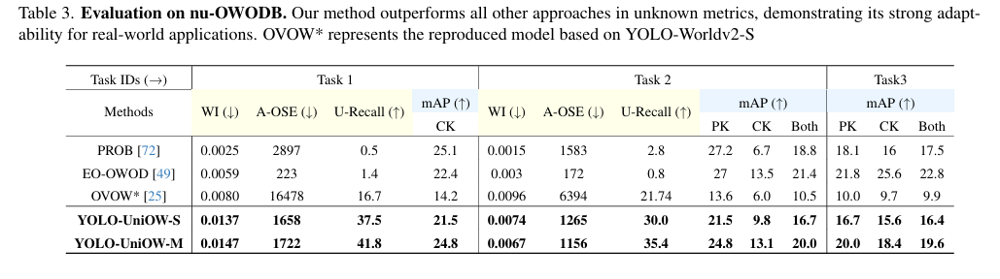

在自动驾驶场景中，所有模型的绝对性能都有所下降，原因在于遮挡严重、物体密集、光照变化大等挑战。YOLO-UniOW的相对优势保持，U-Recall仍大幅领先（37.5 vs OVOW 16.7），证明了方法的泛化能力和鲁棒性。在WI和A-OSE指标分析中，YOLO-UniOW的WI（0.0137）略高于PROB（0.0025），但考虑到U-Recall的巨大提升（37.5 vs 0.5），这是可接受的，A-OSE（1658）明显优于OVOW（16478），说明误报控制良好。

### 4.4.6 与Oracle和零样本基线对比

实验设置：

- **YOLOv10-S-oracle**：使用未知类标签训练的闭集检测器（理论上限）
- **YOLO-UniOW-S-zs**：零样本设置（不进行Wildcard微调）
- **YOLO-UniOW-S**：完整方法（包含Wildcard Learning）

**实验结果：**

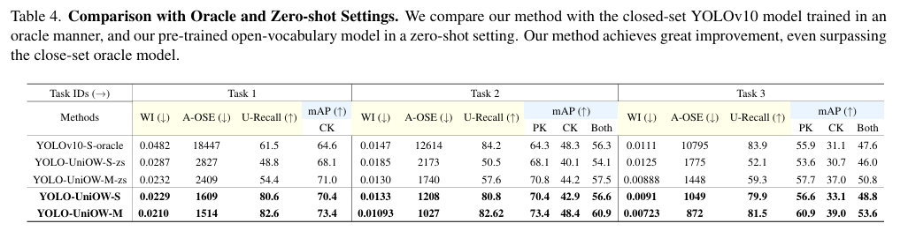

**深度分析：**

YOLO-UniOW-S的U-Recall（80.6）超过Oracle（61.5）19.1个百分点，说明**Wildcard Learning比直接训练"unknown"类更有效**，原因在于Oracle受限于训练数据中的未知类分布，而Wildcard泛化能力更强。Wildcard Learning的增益体现在从零样本（48.8）到完整方法（80.6），U-Recall提升31.8个百分点，已知类mAP也有提升（68.1 → 70.4），证明**Wildcard不会负面影响已知类**。持续性能保持方面，Task 1到Task 2，U-Recall保持稳定（80.6 vs 80.8），说明模型对未知的识别能力不会随着已知类增加而退化。

#### 4.4.7 消融实验

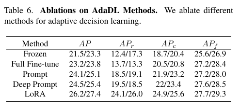

如上表所示，AdaDL组件分析显示，LoRA相比冻结提升4.7 AP（one-to-one），11.7 AP_r，LoRA优于全量微调，避免了过拟合，同时LoRA优于Prompt Tuning，参数效率更高。

结合论文描述，Wildcard Learning组件分析显示，"object"通配符捕获通用物体性，提升U-Recall约16个百分点，加入"unknown"通配符并通过伪标签训练，进一步提升15个百分点，两个通配符协同工作，效果显著。

#### 4.4.8 可视化分析

**复杂场景检测：**


模型能够同时检测已知类（黄色框）和未知类（红色框），未知物体的边界框质量高，位置准确，相比其他方法，YOLO-UniOW的误报更少。

### 4.4.9 局限性与挑战

YOLO-UniOW的局限性主要体现在**Wildcard伪标签质量依赖**，"unknown"通配符的训练依赖于"object"通配符生成的伪标签，如果"object"通配符质量不高，会影响后续训练；**未知类内部的多样性**，所有未知物体都标记为单一"unknown"类，无法区分不同类型的未知物体；**超参数敏感性**，IoU阈值（σ_1=0.5）和置信度阈值（σ_2=0.01）需要根据数据集调整，不同场景的最优超参数可能不同。

综上所述，YOLO‑UniOW 通过 **AdaDL（高效决策学习）** 与 **Wildcard 学习** 的协同，实现了在保证实时性的情况下同时提升零样本泛化与未知发现能力。其在 LVIS/OWOD/COCO 上的综合表现与消融分析均支持该方法作为一个高效、可扩展的统一开放世界检测方案，适合在对延迟敏感且需未知发现的实际场景中部署。


### 4.5OW‑OVD 实验

OW‑OVD旨在将开放词汇检测（OVD）的零样本泛化能力与开放世界检测（OWOD）的未知发现与增量学习能力统一起来。模型基于现有 OVD 架构（以 YOLO‑World 为基础），引入属性选择与不确定性融合机制以实现对未知目标的高质量发现与低干扰识别。

主要评估基准涵盖：**M‑OWODB / S‑OWODB（OWOD）**、**LVIS / COCO（开放词汇/零样本）**以及 **PASCAL VOC（增量学习）**。评估指标包括 **U‑Recall / U‑mAP（未知检测）**、**mAP（已知类）**、**WI / A‑OSE（开放场景干扰度）** 和推理效率指标（FPS）。

### 4.5.1 实验设置

**训练细节：**

- **基础模型**：YOLO-World（YOLOv8架构）
- **核心创新**：
  - **VSAS（Visual Similarity Attribute Selection）**：视觉相似度属性选择
  - **HAUF（Hybrid Attribute-Uncertainty Fusion）**：混合属性-不确定性融合
- **属性生成**：使用GPT-3.5为每个已知类生成25个属性
- **训练流程**：
  1. 在首个epoch构建属性相似度分布
  2. 通过JSD迭代选择最通用的属性
  3. 使用选中属性进行未知物体检测

### 4.5.2 M-OWODB实验

**实验结果：**

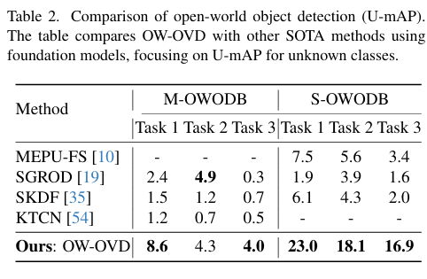

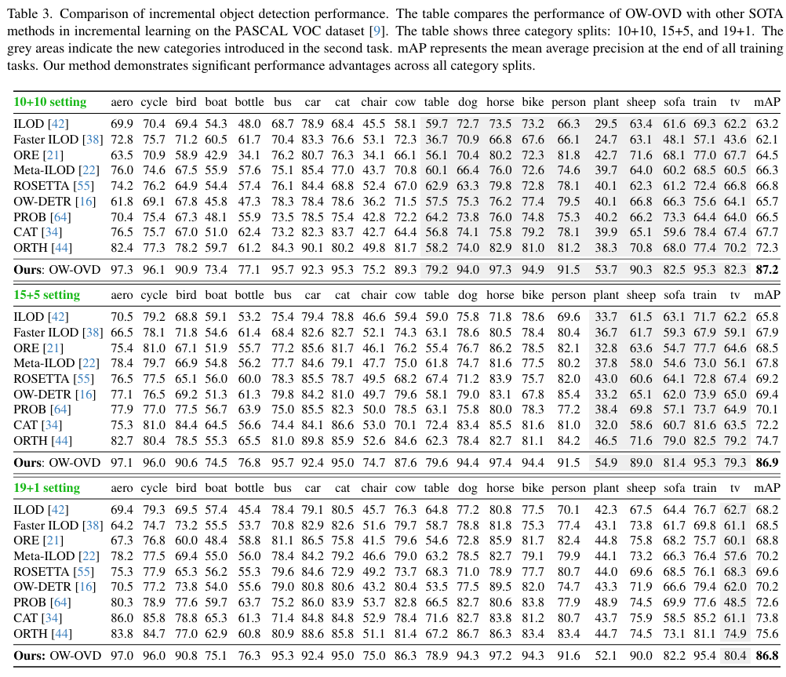

**U-Recall：**OW-OVD在Task 1达到50.0 U-Recall，相比KTCN的41.5提升8.5个百分点，实现20.5%的提升，相比传统方法ORTH的24.6提升25.4个百分点，实现翻倍，证明了VSAS属性选择方法的有效性。

**U-mAP：**Task 1的U-mAP达到8.6，是SKDF的1.5的5.7倍，说明OW-OVD不仅能发现未知物体，而且检测质量高，具有精确的边界框和置信度，这是基于OVD方法相比传统OWOD方法的核心优势。

**已知类性能：**Task 1 mAP达到69.4，相比ORTH的61.3提升8.1个百分点，相比同样使用Foundation Model的KTCN的60.2提升9.2个百分点，证明了HAUF方法不会破坏已知类检测，反而通过更清晰的边界提升性能。

**持续性能：**从Task 1到Task 4，U-Recall保持在50左右，波动很小，说明属性选择策略具有良好的跨任务泛化能力。

### 4.5.3 S-OWODB实验

**关键结果（根据4.5.2节的table2和table3）：**

**U-Recall对比：**

| 模型       | Task 1   | Task 2   | Task 3   |
| ---------- | -------- | -------- | -------- |
| OW-DETR    | 5.7      | 6.2      | 6.9      |
| PROB       | 17.6     | 22.3     | 24.8     |
| ORTH       | 24.6     | 27.9     | 31.9     |
| MEPU-FS    | 37.9     | 35.8     | 35.7     |
| SGROD      | 48.0     | 48.9     | 47.7     |
| SKDF       | 60.9     | 60.0     | 58.6     |
| **OW-OVD** | **76.2** | **79.8** | **78.4** |

**U-mAP对比：**

| 模型       | Task 1   | Task 2   | Task 3   |
| ---------- | -------- | -------- | -------- |
| MEPU-FS    | 7.5      | 5.6      | 3.4      |
| SGROD      | 1.9      | 3.9      | 1.6      |
| SKDF       | 6.1      | 4.3      | 2.0      |
| **OW-OVD** | **23.0** | **18.1** | **16.9** |

**已知类mAP对比：**

| 模型       | Task 1 (CK) | Task 2 (Both) | Task 3 (Both) | Task 4 (Both) |
| ---------- | ----------- | ------------- | ------------- | ------------- |
| ORTH       | 71.6        | 51.3          | 48.8          | 46.2          |
| SKDF       | 69.4        | 44.4          | 40.1          | 38.7          |
| **OW-OVD** | **78.6**    | **69.6**      | **64.7**      | **62.7**      |

OW-OVD在S-OWODB上的优势更明显，Task 1 U-Recall达到76.2，相比SKDF的60.9提升15.3个百分点，实现25.1%的提升，Task 1 U-mAP达到23.0，是MEPU-FS的7.5的3.1倍，是SKDF的6.1的3.8倍，说明VSAS在超类划分场景下更加有效。**已知类性能**大幅领先，Task 1 mAP达到78.6，相比SKDF的69.4提升9.2个百分点，Task 4 mAP达到62.7，相比ORTH的46.2提升16.5个百分点，证明了属性选择和不确定性融合对已知类检测的正面作用。**跨任务稳定性**优异，U-Recall从Task 1到Task 3保持在76-79之间，波动仅3个百分点，而传统方法如PROB波动更大，从17.6到24.8变化7.2个百分点。

### 4.5.4 PASCAL VOC增量学习实验

**实验设置**：

- 三种类别划分：10+10, 15+5, 19+1
- 在第一阶段训练部分类别，在第二阶段训练剩余类别
- 评估最终所有类别的mAP


在**增量学习性能**方面，OW-OVD实现了巨大提升，10+10设置下达到87.2 mAP，相比ORTH的72.3提升14.9个百分点，这说明基于OVD的方法在增量学习上有本质优势。**对类别划分不敏感**方面，三种设置（10+10, 15+5, 19+1）的mAP都在86.8-87.2之间，波动仅0.4个百分点，而传统方法如ORTH在不同设置下波动达3.3个百分点（72.3 → 75.6），说明OW-OVD的泛化能力不依赖于特定的类别划分。无需回放机制方面，传统增量学习方法需要保存旧类别样本来避免灾难性遗忘，而OW-OVD通过冻结文本嵌入**实现无回放的增量学习**，大大降低了存储和计算成本。

#### 4.5.5 消融实验

**实验结果：**

 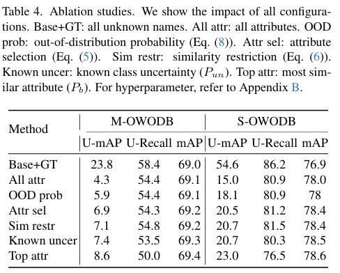

分析上表可以发现，在理论上限方面，使用所有未知类的真实名称作为提示，M-OWODB达到23.8 U-mAP和58.4 U-Recall，S-OWODB达到54.6 U-mAP和86.2 U-Recall，说明OVD方法在**已知类别名称**时的潜力巨大。直接使用所有属性效果不佳，M-OWODB的U-mAP仅4.3，相比GT下降81.9%，原因在于GPT生成的约2000个属性存在大量冗余和不相关信息。

引入已知类的分布外概率后，U-mAP从4.3提升到5.9，帮助区分已知类和未知类的边界。通过JSD选择通用属性，U-mAP进一步提升到6.9，S-OWODB上提升更明显从18.1到20.5。相似度约束防止选择过于相似的属性，保持多样性，M-OWODB从6.9到7.1，S-OWODB从20.5到20.7。结合已知类的预测不确定性帮助识别未知，M-OWODB从7.1到7.4。对最相似的Top-γ属性加权带来最终提升，M-OWODB从7.4到8.6，S-OWODB从20.7到23.0，这是单一组件中贡献最大的。

随着准确性提升，召回率略有下降，这是精度-召回率权衡的正常现象，S-OWODB从All attr的80.9降至完整模型的76.5，但U-mAP大幅提升从15.0到23.0，整体效果更好。

   


### 4.5.6 可视化分析

**复杂场景未知检测（下图）：**

OW-OVD能够准确检测未知物体（红色框），边界框完整，相比KTCN和SGROD，避免了将物体的部分如灯座单独标记误认为未知，减少了重复检测同一物体多个框，未知检测的置信度更合理。

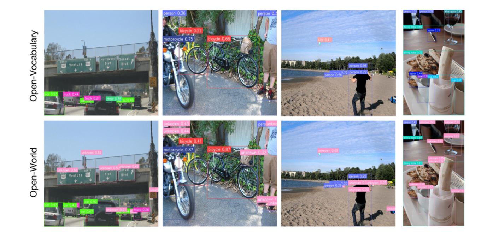


**与GLIP对比：**GLIP在某些小众数据集上表现更好，如PlantDoc的1.1 vs OW-OVD的0.36，但OW-OVD在整体35个数据集上更稳定，说明数据质量和覆盖度对两种方法都很重要。

### 4.5.7 局限性与挑战

OW-OVD的局限性主要体现在**属性生成依赖LLM**，需要GPT-3.5生成属性，引入额外成本，属性质量依赖于LLM的能力和提示词设计；**计算开销**：需要在训练第一个epoch构建所有属性的相似度分布，虽然推理时HAUF是并行的，但训练时间仍有增加；**与真实未知类名称的Gap**：即使使用精心选择的属性，与真实类别名称仍有差距，Base+GT实验显示仍有较大提升空间。

综上所述，OW‑OVD 通过**属性筛选（VSAS）+ 属性‑不确定性融合（HAUF）**的设计，实现了在开放词汇与开放世界场景下对未知目标的高召回与对已知类的低干扰识别。其消融与增量实验进一步说明属性选择与不确定性建模是实现鲁棒未知发现的关键组件，适合在需要持续标注与扩展类别的实际部署管线中使用。

### 4.6 对比分析

#### 4.6.1 性能对比矩阵

**LVIS零样本性能（AP）：**

| 模型                     | 参数量 | AP   | AP_r | FPS  | 主要优势             |
| ------------------------ | ------ | ---- | ---- | ---- | -------------------- |
| Grounding DINO-L         | 341M   | 33.9 | 22.2 | ~1.5 | 高精度，复杂指代理解 |
| YOLO-World-L             | 48M    | 35.4 | 27.6 | 52.0 | 实时性，参数效率     |
| YOLO-UniOW-L             | 29.4M  | 34.6 | 30.0 | 64.8 | 极致效率，未知检测   |
| OW-OVD (YOLO-World base) | -      | -    | -    | -    | 未知检测质量         |

**M-OWODB Task 1性能：**

| 模型            | U-Recall | U-mAP | mAP (已知类) | 综合评价   |
| --------------- | -------- | ----- | ------------ | ---------- |
| KTCN (SOTA传统) | 41.5     | 1.2   | 60.2         | 基线       |
| YOLO-UniOW-S    | 80.6     | -     | 70.4         | 召回率极高 |
| OW-OVD          | 50.0     | 8.6   | 69.4         | 检测质量高 |

**S-OWODB Task 1性能：**

| 模型            | U-Recall | U-mAP | mAP (已知类) |
| --------------- | -------- | ----- | ------------ |
| SKDF (SOTA传统) | 60.9     | 6.1   | 69.4         |
| YOLO-UniOW-S    | 82.2     | -     | 69.2         |
| OW-OVD          | 76.2     | 23.0  | 78.6         |

**核心技术差异：**

| 维度           | Grounding DINO   | YOLO-World   | YOLO-UniOW        | OW-OVD         |
| -------------- | ---------------- | ------------ | ----------------- | -------------- |
| **架构基础**   | DETR/Transformer | CNN/YOLOv8   | CNN/YOLOv10       | CNN/YOLO-World |
| **跨模态融合** | 三阶段深度融合   | RepVL-PAN    | AdaDL（LoRA）     | 无新增融合     |
| **文本编码**   | BERT（冻结）     | CLIP（冻结） | CLIP+LoRA         | CLIP（冻结）   |
| **未知检测**   | 不支持           | 不支持       | Wildcard Learning | VSAS+HAUF      |
| **推理模式**   | 在线交互         | 离线重参数化 | 离线校准          | 并行预测       |
| **主要创新**   | 语言引导查询选择 | 重参数化融合 | 通配符学习        | 属性选择       |

**参数效率对比：**

- **Grounding DINO-L**：341M参数，33.9 AP → 1 AP需要10.0M参数
- **YOLO-World-L**：48M参数，35.4 AP → 1 AP需要1.4M参数（7.1x更高效）
- **YOLO-UniOW-L**：29.4M参数，34.6 AP → 1 AP需要0.85M参数（11.8x更高效）

**速度-精度权衡：**

```
           FPS
            ↑
  100 FPS   | YOLO-UniOW-S (69.2 AP, 98.3 FPS)
            |
   50 FPS   | YOLO-World-L (35.4 AP, 52.0 FPS)
            | YOLO-UniOW-L (34.6 AP, 64.8 FPS)
            |
    2 FPS   | Grounding DINO-L (33.9 AP, ~1.5 FPS)
            |
            └─────────────────────────→ AP
                 30        35        40
```

**未知检测能力对比（S-OWODB Task 1）：**

```
  U-mAP
    ↑
 25 |                    OW-OVD (23.0, 76.2)
    |
 20 |
    |
 15 |
    |
 10 |
    |
  5 | SKDF (6.1, 60.9)            YOLO-UniOW (-, 82.2)
    |
  0 └─────────────────────────────────────→ U-Recall
      50        60        70        80       90
```

**预训练数据规模：**

| 模型             | 检测数据        | 接地数据       | 图文对数据    | 总计  |
| ---------------- | --------------- | -------------- | ------------- | ----- |
| Grounding DINO-L | O365+OI (~2.3M) | GoldG (~0.77M) | Cap4M (~4M)   | ~7M   |
| YOLO-World-L     | O365 (~0.6M)    | GoldG (~0.77M) | CC3M (~0.25M) | ~1.6M |
| YOLO-UniOW-L     | O365 (~0.6M)    | GoldG (~0.77M) | -             | ~1.4M |
| OW-OVD           | O365 (~0.6M)    | GoldG (~0.77M) | -             | ~1.4M |

YOLO系列模型用更少数据达到相近或更好性能，说明架构和训练策略的重要性不亚于数据规模，高质接地数据（GoldG）对所有方法都至关重要。

通过对比分析可以发现，开放词汇检测已进入实时化时代，YOLO-World和YOLO-UniOW证明了轻量级检测器也能胜任开放词汇任务，50+ FPS的速度使其可以部署到实际应用中。基于OVD实现OWOD是正确方向，YOLO-UniOW和OW-OVD都显著超越传统OWOD方法，利用OVD的零样本能力来识别未知是比纯视觉建模更有效的途径。在架构选择上，Transformer如Grounding DINO提供高精度和复杂指代理解但速度慢，而CNN如YOLO系列则速度快效率高但复杂指代理解稍弱，未来可能的方向是混合架构。长尾分布仍是共同挑战，所有模型在稀有类上的性能都显著低于常见类和频繁类，需要更多针对性的数据收集和训练策略。未知检测方面出现了两种有效策略，Wildcard Learning（YOLO-UniOW）简洁高效依赖伪标签，Attribute Selection（OW-OVD）检测质量高依赖LLM生成属性。

效率与性能不是零和博弈，YOLO-UniOW用29.4M参数超越了Grounding DINO-L的341M参数效率，说明架构设计比单纯增加参数更重要。零样本能力是开放世界的基础，所有成功的OWOD方法都基于强大的OVD能力，未来的OWOD研究应该优先考虑如何利用OVD。实时开放感知是可行的，YOLO-UniOW在64.8 FPS下同时实现开放词汇和开放世界检测，为自动驾驶、机器人等实时应用打开了大门。最后，数据质量大于数据数量，高质量的区域级标注如GoldG比大规模弱监督数据更重要，未来应该投入更多资源在数据质量上。

### 4.8 论文结果的本地测试与验证 

我们在尝试复现YOLO-UniOW实验时，由于训练数据量严重不足（仅使用过滤后的COCO训练集约1000张有效图像，而完整数据集有118k张）、训练轮数太少（仅10个epoch，未达到收敛）、模型规模小（使用YOLOv10-S参数较少）等原因，导致评估结果mAP@0.5:0.95仅为0.001，几乎为零。因此，我们最终选择下载官方训练好的YOLO-World和YOLO-UniOW模型，在本地进行测试和验证，而不是进行完整的论文复现，下面展示本地测试的结果：

- YOLO-World：

  

- YOLO-UniOW：

  

